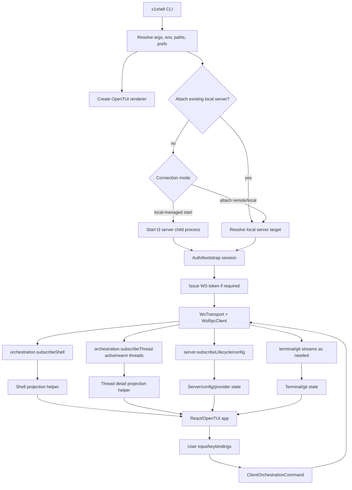

# X1Shell TUI Migration Plan

## 1. Executive Summary

The goal is to add a production-grade OpenTUI-based terminal application named X1Shell to this latest `t3code`-based repository without changing public backend semantics or regressing the existing web, desktop, server, or contracts packages. The only expected server-side behavior changes are the documented stream correctness fixes for `subscribeShell`, `subscribeThread`, and `subscribeLifecycle`, including sequence-consistent thread detail snapshots. If the TUI later decides to treat `server.subscribeConfig` or `server.subscribeAuthAccess` snapshot startup as authoritative instead of using unary reads or treating those streams as advisory/live-incremental only, those streams must meet the same startup-race standard. Any such fixes must preserve RPC method names, payload shapes, auth behavior, and existing web/desktop compatibility.

The migration should treat the current `x1shell` backend, contracts, auth model, and client runtime direction as the source of truth. The legacy `t1code` TUI should be used as a UX and terminal-behavior reference, not as an architecture template. Most TUI-specific pure utilities can be reused after renaming and contract updates, but the old WebSocket push/native API assumptions must be replaced with the current Effect RPC client model, orchestration shell/thread subscriptions, and bearer/WebSocket-token auth flow.

The expected end state is an `apps/tui` workspace package that runs a React/OpenTUI app. The initial TUI runtime should be treated as Bun-hosted: current OpenTUI core uses Bun-specific runtime APIs and declares Bun as its supported engine, so Phase 1 should not promise a Node-only TUI launcher contract. By default the TUI discovers whether a compatible local `t3` server already exists for the intended state root, attaches to that server when it does, and otherwise starts and supervises its own local-managed server with no browser. The TUI then bootstraps the current working directory into the latest orchestration model when needed, obtains an owner session through a current supported auth path, connects over the current WebSocket RPC protocol, and renders sessions, conversation state, streaming agent activity, approvals, and errors from server projections. It should also support explicit attach mode against an already-running local or remote server using the same auth and RPC boundaries as the web app, plus an explicit isolated `--new-server` mode when a second local server is intentionally desired.

## 2. Current Repository Assessment

The target repo is a Bun/Turbo monorepo with workspace globs for `apps/*`, `packages/*`, and `scripts`.

Relevant layout:

```txt
apps/server       Node/Bun HTTP and WebSocket server, provider runtime, persistence, orchestration
apps/web          React/Vite web client
apps/desktop      Electron wrapper around server/web behavior
apps/marketing    Astro marketing site
packages/contracts Effect Schema contracts and Effect RPC group definitions
packages/client-runtime small client-side runtime helpers for known environments and scoped refs
packages/shared   runtime utilities shared by server and clients through explicit subpath exports
packages/effect-* provider protocol support packages
```

Backend/server entrypoints:

- `apps/server/src/cli.ts` owns CLI config resolution, auth/project subcommands, server startup flags, env precedence, and server launch.
- `apps/server/src/server.ts` builds the HTTP server layers, WebSocket RPC route, auth routes, orchestration HTTP routes, static web serving, terminal services, git services, provider services, persistence, and startup lifecycle.
- `apps/server/src/ws.ts` exposes the current Effect RPC WebSocket server through `WsRpcGroup` from `packages/contracts/src/rpc.ts`.
- `apps/server/src/serverRuntimeStartup.ts` gates commands until runtime startup is ready, starts reactors, emits lifecycle `welcome` and `ready` events, and can auto-bootstrap a project/thread from `cwd`.
- Provider/session behavior is decomposed across provider services, adapters, runtime ingestion, command reactors, projection pipeline, checkpointing, and persistence layers. The TUI should not bypass or duplicate any of this.

Contracts/runtime packages:

- `packages/contracts` must remain free of client runtime behavior, transport implementation, or UI logic. It defines branded IDs, Effect schemas, RPC groups, and type-only IPC/local API interfaces.
- `packages/contracts/src/rpc.ts` defines the current RPC methods. Important TUI-facing groups are server config/lifecycle/auth access, orchestration dispatch/diff/subscriptions, terminal operations/events, git operations/status streams, project file search/write, filesystem browse, and shell open-in-editor.
- `packages/contracts/src/orchestration.ts` defines the projection model consumed by clients. The TUI should use `OrchestrationShellSnapshot`, `OrchestrationShellStreamItem`, `OrchestrationThreadDetailSnapshot`, `OrchestrationThread`, `OrchestrationMessage`, `OrchestrationThreadActivity`, checkpoint summaries, runtime modes, interaction modes, and `ClientOrchestrationCommand`. Pending approval and pending user-input UI must be derived from projected thread activities plus shell indicators such as `hasPendingApprovals` and `hasPendingUserInput`; `OrchestrationThread` does not expose first-class pending prompt arrays.
- Be precise about runtime-mode naming. Server launch mode lives in `apps/server/src/config.ts` and is `web|desktop`; orchestration/provider runtime mode lives in `packages/contracts/src/orchestration.ts` and includes agent execution modes such as `full-access`. The TUI must not confuse these two similarly named concepts or send orchestration runtime-mode values as server launch modes.
- `packages/client-runtime` currently contains environment/scoped-ref helpers only and exports only the package root today. The initial migration should preserve that root export until existing web imports are migrated with parity tests. It is the likely home for browser-independent client RPC and environment auth code that both web and TUI can use, but the initial migration should prefer the smallest possible extraction. If extracting the current web transport would pull browser-only observability or state code, a TUI-local copy or duplicate-then-extract step is acceptable for the first implementation as long as the long-term boundary stays clear.
- `packages/shared` uses explicit subpath exports and already contains cross-runtime pure utilities. It is appropriate for generic utilities consumed by server and clients, but not for UI-only state stores or React/OpenTUI code.

Frontend/client patterns:

- `apps/web` currently owns most browser client infrastructure, including `apps/web/src/rpc/wsTransport.ts`, `apps/web/src/rpc/wsRpcClient.ts`, `apps/web/src/rpc/protocol.ts`, environment runtime connection management, and React Query/Zustand state.
- Web connects to a known environment, obtains/uses WebSocket URLs, creates an Effect RPC transport, subscribes to `server.subscribeLifecycle`, `server.subscribeConfig`, `orchestration.subscribeShell`, `orchestration.subscribeThread`, and `terminal.onEvent`, then applies snapshots/events to client state.
- Web keeps shell subscriptions and thread-detail subscriptions separate. Shell state is broad and always-on; thread detail subscriptions are retained, warmed, and evicted with a cache policy.
- Web currently imports `KnownEnvironment` and scoped-ref helpers from the root `@t3tools/client-runtime` export. Adding shared subpaths must not break those existing imports during the TUI migration.
- Web already models remote/attach auth: exchange a pairing/bootstrap credential for a bearer session, fetch `/api/auth/session`, issue a short-lived `/api/auth/ws-token`, and connect to `/ws?wsToken=...`.

Build/dev/test tooling:

- Root scripts: `bun fmt`, `bun lint`, `bun typecheck`, and `bun run test`.
- `bun test` must not be used.
- Root `fmt` is `oxfmt`; `lint` is `oxlint --report-unused-disable-directives`; `typecheck` is `turbo run typecheck`; `test` is `turbo run test`.
- Package tasks generally expose `typecheck` and `test`; build tasks depend through Turbo.
- Server package name is currently `t3` with binary `t3`; a TUI package should use an X1Shell-specific binary name while preserving the current server binary behavior.

## 3. Legacy `t1code` TUI Assessment

The legacy repo contains an `apps/tui` package that proves a React/OpenTUI terminal client can work for this product direction. It includes a Bun-run app entry, OpenTUI renderer setup, server supervision, attach-only mode, preferences, themes, keyboard behavior, responsive layout, message markdown helpers, image paste/preview support, git quick actions, session/sidebar UX, and many unit-tested pure helpers.

What exists:

- `apps/tui/src/index.tsx` creates the OpenTUI renderer, configures terminal ownership, mouse, Kitty keyboard, terminal palette/theme detection, signal handling, headless snapshot mode, and React root rendering.
- `apps/tui/src/ui.tsx` is a very large app component that owns connection setup, state, session/sidebar UX, composer behavior, approvals/input, model controls, git/diff flows, settings, keybindings, and rendering.
- `apps/tui/src/serverSupervisor.ts` starts a local server process, reserves loopback ports, polls readiness, restarts after unexpected exits, captures fatal startup errors, and supports attach-only mode through environment variables.
- Pure helper modules cover config paths, preferences, themes, renderer theme detection, keyboard behavior, responsive layout, composer submission, markdown parsing, sidebar context menus, thread title/selection/session state, snapshot refresh coalescing, open-external behavior, image clipboard/terminal images, and work-entry icons.
- Tests exist for many pure modules and the supervisor.

Useful pieces:

- Renderer lifecycle setup from `index.tsx`: terminal ownership, mouse toggles, Kitty keyboard detection, controlled shutdown, headless test renderer mode, terminal palette detection, and theme initialization.
- TUI-only helper ideas with tests: `config`, `prefs`, `theme`, `rendererTheme`, `responsiveLayout`, `keyboardBehavior`, `messageMarkdown`, `messageLayout`, `composerAction`, `composerCommands`, `composerControlLabels`, `composerSync`, `composerSubmit`, `sidebarContextMenu`, `sidebarProjects`, `threadTitle`, `threadSelection`, `snapshotRefresh`, `workEntryIcons`, `openExternal`, `clipboardImage`, and `terminalImages`.
- Supervisor concepts: local-managed default, attach mode, loopback port selection, readiness timeout, restart policy, log capture, graceful process stop.
- UX ideas: compact sidebar, conversation timeline, composer controls, command-like overlay menus, pending approval/input panels, diff panel, settings/keybindings screen, terminal image previews.

Outdated or risky pieces:

- The transport in `t1code` uses a legacy JSON envelope and push-channel protocol, not the current Effect RPC socket protocol in `packages/contracts/src/rpc.ts`.
- The old native API wrapper calls methods such as `orchestration.getSnapshot`, `orchestration.onDomainEvent`, `git.status`, old server welcome/config push channels, and manually constructed native API request envelopes. The current server uses `orchestration.subscribeShell`, `orchestration.subscribeThread`, `git.refreshStatus`, streaming RPCs, and lifecycle/config stream RPCs.
- `serverSupervisor.ts` launches the server with old flags such as `--mode tui`, `--auth-token`, and `--home-dir`. The current server supports `--mode web|desktop`, `--base-dir`, `--auto-bootstrap-project-from-cwd`, `--no-browser`, `--bootstrap-fd`, persisted runtime state, bearer-session issuance through `t3 auth session issue`, and auth bootstrap/pairing flows. `T3CODE_AUTH_TOKEN` may still appear in build env allowlists, but it is not a supported current server launch flag.
- `ui.tsx` imports a legacy `@t3tools/client-core` package. The current target repo has `@t3tools/client-runtime` instead, and much of the reusable logic now lives inside `apps/web`.
- The monolithic `ui.tsx` is too large to migrate directly. Copying it would preserve old coupling and make the new TUI difficult to maintain.
- Legacy assumptions around provider options, model selection, settings, pending input, and timeline entries may not match the current contracts and web logic.
- Several helper modules import legacy `@t3tools/client-core` types or re-export its logic. A helper is not reusable until those imports are audited and mapped to current contracts, `packages/client-runtime`, `packages/shared`, or TUI-local types.

Reuse/rewrites:

- Reuse small, pure, unit-tested TUI helpers only after an import/contract audit. Renaming `T1CODE_*` envs is necessary but not sufficient; any dependency on legacy `@t3tools/client-core` must be replaced or the helper must be rewritten.
- Refactor renderer startup and server supervision rather than copying unchanged.
- Rewrite transport, connection bootstrapping, orchestration state store, session detail subscription logic, and command dispatch around the current `WsRpcGroup`/`WsRpcClient`.
- Rewrite `ui.tsx` into small React components, hooks, and stores. It can guide UX behavior but should not be the implementation substrate.
- Drop the old `@t3tools/client-core` transport/native API path and any old backend compatibility shims.

## 4. OpenTUI / OpenCode Reference Findings

OpenTUI findings:

- React binding is available through `@opentui/react`, while renderer creation comes from `@opentui/core`. The expected boot path is `createCliRenderer(...)` from `@opentui/core`, then `createRoot(renderer).render(<App />)` from `@opentui/react`.
- The current local OpenTUI source baseline is `@opentui/core@0.1.103` and `@opentui/react@0.1.103`. Phase 1 should pin exact OpenTUI versions rather than ranges, including matching native optional packages, unless a newer version is deliberately verified against this repo before implementation starts. The published packages are available at this version, but `@opentui/react` brings React 19 peer expectations and `@opentui/core` brings native optional packages plus `web-tree-sitter`; Phase 1 dependency work must validate the full install/typecheck path rather than assuming the two top-level OpenTUI packages are sufficient. If `apps/tui` lists OpenTUI native packages directly, they must be listed under `optionalDependencies`, not required `dependencies`, so cross-platform installs do not try to install incompatible native binaries.
- Current OpenTUI source is Bun-oriented in practice: `@opentui/core` declares a Bun engine and uses Bun runtime APIs such as `bun:ffi` and `Bun.stripANSI`. The first X1Shell release should therefore treat the TUI process itself as Bun-hosted even if it spawns a Node child process for the current `t3` server.
- Legacy `t1code` renderer boot code targets older OpenTUI config conventions. Current OpenTUI expects explicit mode enums such as `screenMode`, `externalOutputMode`, and `consoleMode`; do not copy legacy `useAlternateScreen`-style renderer flags verbatim when adapting `apps/tui/src/index.tsx`.
- TypeScript should use `jsx: "react-jsx"` and `jsxImportSource: "@opentui/react"` for TUI JSX intrinsic elements.
- Main components map to core renderables: `<box>`, `<text>`, `<span>`, `<scrollbox>`, `<input>`, `<textarea>`, `<select>`, `<tab-select>`, `<code>`, `<line-number>`, `<diff>`, `<markdown>`, `<ascii-font>`, links, and text modifier elements.
- Hooks include `useRenderer`, `useKeyboard`, `useOnResize`, `useTerminalDimensions`, and `useTimeline`.
- Current OpenTUI renderer terminal ownership is configured through `screenMode` in `CliRendererConfig`. Normal interactive X1Shell should request `screenMode: "alternate-screen"`; test/headless renderers can use the test renderer defaults or explicit non-interactive modes.
- Mouse behavior is split across two current OpenTUI flags: `useMouse` enables mouse input, while `enableMouseMovement` controls motion events. Treat them as separate policy decisions instead of one generic "mouse on/off" toggle when adapting legacy renderer boot code.
- OpenTUI Markdown is not automatically safe for untrusted model/tool text. The current parser hardcodes GFM-style bare-URL linkification, preserves Markdown link/image targets as link metadata, and the renderer can emit OSC 8 terminal hyperlinks for those links. The initial X1Shell implementation should not pass raw untrusted strings directly to OpenTUI `<markdown>`. The preferred safe default is a TUI-local restricted Markdown renderer or preprocessing pipeline that neutralizes explicit link/image destinations and bare URLs before any OpenTUI Markdown lexer runs and proves via captured-frame tests that no OSC 8 output is produced.
- OpenTUI requires explicit lifecycle cleanup. `root.unmount()` should happen before `renderer.destroy()`, and cleanup must run on normal exit, explicit quit, signal handling, and unhandled error paths. The renderer also installs default process handlers, so X1Shell should avoid double cleanup by centralizing shutdown.
- Ctrl+C behavior should be app-controlled with `exitOnCtrlC: false` so X1Shell can distinguish interrupt-turn from quit.
- Keyboard events are structured and support Kitty keyboard protocol. This improves modifier/release reliability in Ghostty, Kitty, WezTerm, and iTerm.
- Paste events should be decoded explicitly through OpenTUI utilities instead of treated as keypresses.
- Focus routing should be explicit: composer, sidebar, timeline, command palette, diff, and dialogs should own focus transitions predictably.
- Test renderer support can capture terminal frames for smoke/snapshot tests without running an interactive terminal. Its current default screen mode is the non-interactive test setup rather than alternate-screen behavior, so tests should set any screen-mode assumptions explicitly.

OpenCode production TUI findings:

- OpenCode is Solid, so implementation code is not directly reusable, but its production patterns are relevant.
- It separates app boot, route state, SDK/event subscriptions, sync store, local preferences, theme, keybindings, dialogs, command palette, prompt, and session views into distinct contexts/modules.
- It batches high-frequency streaming events before updating UI state. Its SDK provider queues events and flushes immediately or within a 16 ms window to reduce render churn while preserving responsiveness.
- It bootstraps critical data first, then loads non-critical data asynchronously. X1Shell should similarly show useful shell/session state as soon as the shell snapshot arrives, then hydrate thread details and expensive diffs on demand.
- It keeps route/session navigation independent from transport details.
- It has explicit attach mode for existing servers and a local-managed worker/server flow for default operation.
- It primarily renders assistant Markdown through `<code filetype="markdown" streaming={true}>`, while native `<markdown>` remains behind an experimental flag. X1Shell should treat that as a useful presentation reference, not as proof that raw untrusted Markdown is terminal-safe enough to bypass the stricter Phase 2 safe Markdown adapter.
- It uses clear loading states, toast/dialog layers, route-level error handling, and startup loading overlays.
- It limits retained message/detail data in hot views and syncs session details on demand.
- It configures OpenTUI renderer for controlled exit, mouse, Kitty keyboard, external output behavior, and debug/console behavior.

Performance considerations from OpenTUI/OpenCode:

- Batch event application, especially streaming message/activity updates.
- Keep large scrollback/conversation content explicitly windowed or virtualized to what the terminal view can render. Clipping in a scroll container is not enough if React/OpenTUI still reconciles thousands of child elements.
- Avoid re-rendering the whole app for every token or activity event.
- Use shell-level summaries for sidebars and subscribe to full thread detail only for active/warm threads.
- Render markdown/code/diffs lazily or with truncation until explicitly expanded.
- Handle resize through a single reactive dimensions source and memoized layout calculation.

Testing/debugging patterns:

- Use OpenTUI test renderer for headless frame captures and focused component rendering tests.
- Keep pure behavior in testable modules outside React components.
- Add debug console/log panel and file logs for transport, supervisor, and state reducer events.
- Preserve an environment-driven headless mode for CI/manual snapshot generation.

## 5. Proposed Monorepo Structure

Target structure:

```txt
apps/tui/
  package.json
  tsconfig.json
  tsdown.config.ts
  bin/x1shell.js
  README.md
  src/
    index.tsx
    app/App.tsx
    app/providers.tsx
    cli/args.ts
    cli/config.ts
    runtime/serverSupervisor.ts
    runtime/attach.ts
    runtime/connection.ts
    runtime/log.ts
    state/orchestrationStore.ts
    state/threadDetailStore.ts
    state/serverConfigStore.ts
    state/terminalStore.ts
    domain/commands.ts
    domain/sessionSelection.ts
    domain/timeline.ts
    domain/pendingActions.ts
    ui/layout/ResponsiveShell.tsx
    ui/sidebar/SessionList.tsx
    ui/conversation/ConversationView.tsx
    ui/composer/PromptBox.tsx
    ui/status/StatusBar.tsx
    ui/commandPalette/CommandPalette.tsx
    ui/diff/DiffView.tsx
    ui/logs/DebugPanel.tsx
    terminal/theme.ts
    terminal/keyboard.ts
    terminal/safeTextStream.ts
    terminal/safeMarkdown.tsx
    terminal/openExternal.ts
    terminal/images.ts
    terminal/resize.ts
    test/headlessRenderer.ts

packages/client-runtime/
  src/ws/
    protocol.ts
    transport.ts
    rpcClient.ts
  src/environment/
    knownEnvironment.ts
    connection.ts
    auth.ts
  src/orchestration/                 # Post-Phase-6 only, and only after projection helpers have a real second caller.
    shellProjection.ts
    threadDetailProjection.ts
```

Recommended package policy:

- Add `apps/tui` as the application package. It should own all OpenTUI, React, terminal, keyboard, renderer, and CLI UX code.
- The product namespace decision is explicit: the TUI package name is `@x1shell/tui`, and the user-facing binary is `x1shell`. Use `@x1shell/tui` for workspace filters, dependency declarations, package metadata, and any publish/config references. Keep existing internal shared package imports under their current `@t3tools/*` names unless those packages are renamed in a separate repo-wide namespace migration.
- `apps/tui` should be documented and packaged as a Bun-hosted CLI in the first release. `bin/x1shell.js` should either re-exec Bun or fail clearly when Bun is unavailable; do not promise a Node-only TUI runtime contract while OpenTUI remains Bun-bound.
- Do not make shared client-runtime extraction the first blocking step on the TUI critical path. The first end-to-end attach/local-managed implementation may use TUI-local transport/auth modules or a narrow copy of web logic and extract shared code only after the TUI path works.
- Any extraction into `packages/client-runtime` must either be consumed by the TUI immediately or replace an existing caller with parity tests. Do not create a speculative second transport stack that is unused by both web and TUI.
- Add orchestration projection helpers to `packages/client-runtime` only after the first TUI projection implementation proves the helpers can stay contract-shaped, UI-neutral, and independent of React/OpenTUI/Zustand/web store models. TUI-local projection code is preferable to a premature shared abstraction.
- Add explicit `packages/client-runtime` subpath exports as modules are introduced, for example `@t3tools/client-runtime/ws`, `@t3tools/client-runtime/environment`, and later `@t3tools/client-runtime/orchestration` if projection helpers are extracted. Preserve the current root export until web callers are migrated; do not rely on a growing barrel as the long-term boundary.
- Allow `packages/client-runtime` to depend on `effect`, `@t3tools/contracts`, and narrowly selected `@t3tools/shared/*` subpaths as needed. It must not depend on `apps/web`, React, Zustand, React Query, Vite, `window`, or browser-only observability modules.
- Do not add a TUI shared package initially. Keep TUI-specific modules inside `apps/tui` until there is a second terminal consumer or a clear package boundary.
- Do not put runtime logic in `packages/contracts`. Only add or modify schemas there when current server semantics require it, which is not expected for the initial migration.
- Use `packages/shared` only for generic, non-UI runtime utilities that are useful outside the TUI and do not depend on React/OpenTUI/browser APIs.

Why this structure:

- `apps/tui` stays independently buildable and publishable.
- Client transport and environment bootstrapping become reusable between web and TUI without importing from `apps/web`.
- The TUI app remains modular: rendering, input, runtime connection, state projection, and domain commands can be tested separately.
- It leaves the existing web and desktop behavior intact and avoids public backend contract changes. Existing web files can continue to use their current local RPC code until a deliberate extraction phase moves them to `packages/client-runtime`; the stream correctness prerequisite is treated as a shared server reliability patch with regression coverage, not a TUI-only semantic change.

## 6. TUI Runtime Architecture

Process/runtime contract:

- X1Shell should be a Bun-hosted CLI process in the initial migration. The TUI may spawn a Node child process for the current `t3` server, but the TUI entrypoint itself should not claim Node-only support until OpenTUI is deliberately re-verified in that runtime.

Runtime flow:

1. Parse CLI args and env.
2. Resolve TUI paths, preferences, renderer flags, logging path, and mode.
3. Start OpenTUI renderer with controlled cleanup, `screenMode: "alternate-screen"` for normal interactive mode, mouse, Kitty keyboard, and initial theme.
4. Resolve server target:
   - Default local behavior: determine the intended server state root first. If a compatible local server already owns that state root, attach to it instead of starting a second process. If no compatible local server exists, start the current `t3` server as a child process with loopback host, an available port, `--no-browser`, `--auto-bootstrap-project-from-cwd`, `--base-dir`, and a supported owner-session bootstrap path. Do not use `t3 serve` for the default local-managed flow, because current `serve` uses headless startup presentation and forces cwd auto-bootstrap off.
   - Attach mode: use provided HTTP/WS base URL plus bearer/bootstrap credential, or existing local persisted server state if a compatible local attach shortcut is added.
   - Explicit isolated mode: `--new-server` means do not attach to an already-running local server. It must start a second server only with an isolated base dir, either user-provided or deterministically derived for TUI use, so two local server processes never share the same `state.sqlite`, auth secrets, logs, attachments, or `server-runtime.json`.
5. Authenticate if needed:
   - Attach-first local reuse should obtain an owner bearer session against the same base dir through the auth control plane, then issue a WebSocket token against the discovered server origin. Discovery alone is not authentication.
   - Local-managed should obtain an owner credential through one of the explicit supported flows below, not a legacy static `--auth-token`.
   - Remote attach should exchange a pairing/bootstrap credential for a bearer session, fetch session state, issue a short-lived WebSocket token, and connect to `/ws?wsToken=...`.
6. Create `WsTransport` and `WsRpcClient`.
7. Subscribe to server lifecycle/config, orchestration shell, terminal events, and the selected thread detail.
8. Apply snapshots before events, then close the snapshot-to-live startup gap through the stream correctness strategy in the backend integration section. Track projection sequence so stale snapshots/events are ignored.
9. Render shell/sidebar immediately after shell snapshot. Hydrate active thread detail and expensive data on demand.
10. Dispatch user commands through `orchestration.dispatchCommand`; never call provider adapters directly.
11. On reconnect, recreate the RPC session, reissue WebSocket token when needed, resubscribe shell/thread streams, and replace state from snapshots.
12. On shutdown, unsubscribe streams, dispose RPC transport, stop local server if owned, persist prefs, unmount React root, destroy renderer, and exit.

Local server ownership and coexistence policy:

- `T3CODE_HOME` is the server base directory. The current server derives persistent paths such as `state.sqlite`, settings, secrets, logs, attachments, and `server-runtime.json` from it. A single local server process may be shared by multiple clients safely; multiple independent local server processes must not implicitly share the same state root.
- The intended local state root is not keyed by `T3CODE_HOME` alone. Current server path derivation uses `baseDir/userdata` for normal runs and `baseDir/dev` when `devUrl` is set. Local discovery, runtime-state lookup, and local auth/session issuance must therefore use the same server-location inputs as the server CLI: `--base-dir <dir>` plus matching `--dev-url <url>` whenever the TUI is intentionally targeting a dev-scoped server state root.
- Default policy: attach-first. If a compatible local server already exists for the intended state root, the TUI attaches to that server and reuses its projections, auth surface, and history.
- Managed-start policy: if no compatible local server exists for the intended state root, the TUI starts one and owns its lifecycle.
- Explicit second-server policy: if the user requests `--new-server`, the TUI must not silently start a second server against the same default state root. `--new-server` requires either a user-provided isolated `--base-dir`, or the TUI launcher must deterministically choose and document a separate `--base-dir` value before spawning the server.
- Compatibility check for attach-first must be explicit in code and tests. For the intended local state root, the TUI should: read persisted `server-runtime.json`; verify pid liveness when available; fetch `/.well-known/t3/environment`; compare the descriptor's `environmentId` to the locally persisted `environment-id` for the intended state root; enforce a documented minimum compatible `serverVersion` or equivalent capability predicate; and only then attempt owner-session issuance plus WebSocket-token exchange. The environment descriptor does not contain a base-dir or state-root path, so origin reachability alone does not prove state-root compatibility. If the intended local `environment-id` cannot be read, compatibility is unproven and the TUI must not infer a match from origin alone.
- Attach-first local auth path: when reusing a discovered running local server, the TUI should obtain an owner bearer session against the same server-location scope with `<resolved-server-entry> auth session issue --token-only --role owner --base-dir <dir>` plus matching `--dev-url <url>` whenever the intended local state root is dev-scoped, then call `POST /api/auth/ws-token` against the discovered origin and connect. `server-runtime.json` only provides origin/pid metadata; it does not provide credentials. `bootstrap-fd` and `desktopBootstrapToken` are for newly spawned child servers only and must not be assumed to exist for an already-running local server.
- If pid/origin checks or descriptor compatibility checks fail, treat the runtime-state record as stale, clear it best-effort, and continue with normal attach-first discovery or managed start for that state root. Stale-record cleanup must be conservative: only remove the record after failed liveness/origin/environment validation proves it is not owned by a currently compatible server, and use compare-before-delete semantics. Before unlinking `server-runtime.json`, reread it and delete only if it still matches the stale record just validated; tolerate unlink/write races where another process already removed or replaced the record. If a discovered local server is reachable and descriptor-compatible for the intended state root but local auth/control-plane issuance or WebSocket-token exchange fails, surface an actionable attach error. Do not start a second server against the same state root in response to that auth failure; only an explicit isolated `--new-server` flow may start another local server.
- The doc intentionally targets the same product behavior as today's clients: web, desktop, and TUI should share chat history when they are attached to the same backend/state root. The TUI should not create a second local backend by default when a compatible one already exists.
- Repo-dev/local-dev policy: when the TUI is launched with an explicit dev target such as `--dev-url` or another later documented repo-dev mode, it should attach only to a compatible server using that same dev-scoped state root and pass the same `--dev-url` into local auth/session issuance. A standalone local TUI run without dev targeting should use the normal `userdata` state root by default and should not silently cross-attach to a dev-scoped server.

Local-managed auth and startup protocol:

- Preferred protocol for initial implementation: spawn the server with `--bootstrap-fd 3`. The child process must receive fd `3` as a readable pipe/file descriptor. The TUI parent writes exactly one newline-terminated JSON bootstrap envelope to the parent side of that pipe, then closes the pipe. The envelope must be written immediately after spawn and within the server's current bootstrap read timeout; do not rely on delayed writes.
- The bootstrap envelope should include `mode: "desktop"`, `noBrowser: true`, `host: "127.0.0.1"`, `port`, `t3Home`, `desktopBootstrapToken`, and `autoBootstrapProjectFromCwd: true`. The `desktopBootstrapToken` must be high-entropy, one-use, and kept outside renderer state and debug panels.
- After the server responds on HTTP, call `POST /api/auth/bootstrap/bearer` with `{ "credential": desktopBootstrapToken }`. Store the returned bearer session token in memory only for local-managed mode unless a later explicit persistence feature is designed.
- Call `POST /api/auth/ws-token` with `Authorization: Bearer <sessionToken>` and connect to `/ws?wsToken=<shortLivedToken>`. Reissue the WebSocket token on reconnect.
- Fallback protocol if bootstrap-fd is rejected during implementation review or proves impractical in tests: before starting the server, run the current auth control-plane command against the same server-location scope, `<resolved-server-entry> auth session issue --token-only --role owner --base-dir <dir>` plus matching `--dev-url <url>` whenever the managed server target is dev-scoped, then start `<resolved-server-entry> start --mode desktop --host 127.0.0.1 --port <port> --base-dir <dir> --no-browser --auto-bootstrap-project-from-cwd>` plus the same `--dev-url <url>` when targeting a dev-scoped state root. Starting the fallback server in desktop mode is required so startup uses the same local-managed auth policy and does not print or log a fresh pairing URL/token as part of normal startup. Use the issued bearer token to call `/api/auth/ws-token` with an `Authorization` header and connect. `<resolved-server-entry>` means the deterministic source, built, or packaged server entry selected by the supervisor, not a global `t3` fallback.
- Do not parse `t3 serve` human output as the TUI's primary credential path. The current headless `serve` command prints pairing details but intentionally disables auto-bootstrap, so it is suitable for manual headless pairing, not the default TUI supervisor.
- Do not introduce `--mode tui`, `--auth-token`, or `--home-dir` on the spawned `t3` server command. The existing repo dev-runner may keep its own `--home-dir` wrapper alias for setting `T3CODE_HOME`; this prohibition is specifically about the direct server CLI arguments used by the TUI supervisor. If a future backend change adds a first-class TUI mode, it must be a separate backend design task, not part of the initial additive TUI migration.
- Reusing `mode: "desktop"` for local-managed TUI startup is intentional. It matches the current local desktop-managed auth policy and bootstrap method names; it is not a claim that TUI is an Electron client or that backend launch semantics become otherwise desktop-specific.
- Existing local attach-first reuse should prefer the same auth-control-plane bearer-session path instead of pairing-link scraping, desktop bootstrap reuse, or server stdout parsing. The attach-first and local-managed flows should converge on the same steady-state authenticated transport once the bearer session is obtained.
- Bind local-managed servers to loopback by default. Network-accessible hosts must be an explicit attach/server feature with visible security messaging.
- Never log bootstrap envelopes, bearer tokens, WebSocket tokens, pairing credentials, cookies, or URLs containing `wsToken`. The supervisor logger must redact these fields before writing to files, debug panels, stdout, or stderr. Redaction must apply to structured log fields and unstructured process data, including child argv, env snapshots, stdout lines, stderr lines, error messages, and debug-panel payloads.
- The shared WebSocket/client-runtime layer must not emit raw connection URLs to lifecycle callbacks, request tracking, debug stores, or logs. If a URL contains a query string or fragment, callbacks must receive a redacted URL or structured non-secret fields such as origin, protocol, and pathname only.

Local-managed readiness protocol:

- Treat the server as ready only after the TUI can fetch `/.well-known/t3/environment`, complete auth, issue or validate a WebSocket token, read initial provider/config state through `server.getConfig`, optionally refresh providers through `server.refreshProviders` for interactive pickers, subscribe to `server.subscribeLifecycle`, observe a `ready` lifecycle event, and receive the first `orchestration.subscribeShell` snapshot. `server.subscribeLifecycle` replays the latest `welcome` and latest `ready` event and then live lifecycle events; it does not emit a separate lifecycle `snapshot` event type.
- `server.subscribeLifecycle` must be covered by the Phase 3B stream correctness gate before lifecycle `ready` is used as a hard startup requirement. The current readiness design depends on not missing a `ready` event emitted between the lifecycle replay read and live subscription. If that backend fix is deferred, local-managed readiness must treat authenticated WebSocket connection plus first shell snapshot as the hard gate and lifecycle events as advisory status only.
- Current startup can publish an initial `welcome` without bootstrap target IDs and a later bootstrapped `welcome` after cwd auto-bootstrap completes. The TUI must not lock selection from the first welcome alone. Prefer shell snapshot reconciliation; apply bootstrapped welcome IDs only while the TUI has no user-owned selection.
- TCP port availability or child stdout alone is not readiness.
- The supervisor may read persisted `server-runtime.json` as an attach shortcut, but it must verify the pid/origin and auth before trusting it.
- Port reservation has a time-of-check/time-of-use race. The supervisor should retry on bind failures and avoid assuming a pre-reserved port remains available.



## 7. Backend Integration Strategy

The TUI should integrate as another client of the latest backend.

Contracts to consume:

- `WsRpcGroup`, `WS_METHODS`, and `ORCHESTRATION_WS_METHODS` from `@t3tools/contracts`.
- `ServerConfig`, `ServerLifecycleStreamEvent`, `AuthSessionState`, `AuthBearerBootstrapResult`, and `AuthWebSocketTokenResult`.
- `OrchestrationShellStreamItem`, `OrchestrationThreadDetailSnapshot`, `OrchestrationThread`, `OrchestrationThreadShell`, `ClientOrchestrationCommand`, `RuntimeMode`, `ProviderInteractionMode`, and model/provider schemas.
- `TerminalEvent`, git status/action stream schemas, project search schemas, filesystem browse schemas, and diff result schemas.

Client runtime APIs to reuse or extract:

- Shared extraction is optional for the first TUI delivery. If it does not slow the critical path, extract only the runtime-neutral Effect RPC protocol pieces that the TUI immediately consumes into `packages/client-runtime`, including protocol URL resolution to `/ws`, retry policy, lifecycle hooks, request tracking hooks where appropriate, and typed `createWsRpcClient`. If wholesale movement of the current web transport would drag browser-only dependencies into the shared package, keep the first TUI implementation narrower, use TUI-local equivalents, and extract incrementally after parity tests exist. Any extracted protocol must allow a runtime-supplied `WebSocket` constructor and must not import web connection state, tracing stores, React, React Query, Zustand, Vite, or `window`.
- Keep browser-specific connection state UI out of `packages/client-runtime`; provide lifecycle callbacks so web and TUI can update their own status stores.
- Lifecycle callbacks from `packages/client-runtime` must be secret-safe by construction. They should not receive raw URLs containing `wsToken`, bearer tokens, credentials, cookies, pairing fragments, or arbitrary query strings. Redaction must happen before callbacks run, not only before log sinks write.
- The typed `createWsRpcClient` extracted to `packages/client-runtime` must expose every current RPC method the TUI plan may need, including `orchestration.replayEvents`. The current web-local client omits `replayEvents`; this omission must be fixed in the extracted client if the client-side stream-gap fallback remains part of the plan.
- Add environment auth helpers based on current `apps/web/src/environments/remote/api.ts`, but make them runtime-neutral by avoiding `window.location.origin`.
- If Phase 3 adds `packages/client-runtime` subpath exports, it must preserve the current root `@t3tools/client-runtime` export until existing web imports are migrated in the same phase or a later parity-tested phase.
- Keep first projection reducers TUI-local unless the implementation proves they are raw-contract and UI-neutral. If extracted later, pure projection helpers must understand the actual stream shapes:
  - Shell stream inputs are `OrchestrationShellStreamItem`: a shell snapshot or shell events `project-upserted`, `project-removed`, `thread-upserted`, and `thread-removed`.
  - Thread stream inputs are `OrchestrationThreadStreamItem`: a thread-detail snapshot or a filtered raw `OrchestrationEvent`. The current filtered event set is `thread.message-sent`, `thread.proposed-plan-upserted`, `thread.activity-appended`, `thread.turn-diff-completed`, `thread.reverted`, and `thread.session-set`.
  - Shell snapshots/events own project lists, thread shells, sidebar summaries, session summary, turn state summary, archived/deleted visibility, runtime mode, interaction mode, and pending user-action indicators.
  - Thread detail snapshots/events own active conversation content: messages, activities, proposed plans, checkpoints, turn diff summaries, detailed session data, and per-thread content caches.
  - Shell and thread detail streams may both update shell/session/turn state for the active thread. Reducers must use structural equality and sequence guards so duplicate equivalent updates do not cause unnecessary renders.
  - The TUI should model web's split ownership before simplifying it. Do not implement a single generic "thread reducer" that assumes `subscribeThread` receives every thread domain event.

WebSocket/RPC flow:

- The server route is `/ws`. The client should pass either a base WS URL and let the protocol layer set pathname to `/ws`, or pass a resolved URL with `wsToken` while preserving query params.
- Unary requests use typed Effect RPC methods through `WsRpcClient`.
- Streaming subscriptions should use `transport.subscribe` semantics with resubscribe hooks, snapshot replacement, and backoff.
- The TUI should not depend on legacy push channels or manually constructed native API request envelopes. Effect RPC may use tagged protocol frames internally, but TUI code should call the typed `WsRpcClient` methods instead of building protocol frames itself.

Stream correctness gate:

- Source review found that current `orchestration.subscribeShell`, `orchestration.subscribeThread`, and `server.subscribeLifecycle` build streams as replay/snapshot followed by a live PubSub stream. That shape can miss events emitted after the snapshot/replay value is read but before the live stream is subscribed.
- Source review found that current `server.subscribeConfig` also uses a snapshot-then-live startup shape. The initial TUI implementation should not depend on `subscribeConfig` snapshot startup for authoritative provider bootstrap. Instead it should use `server.getConfig` plus explicit `server.refreshProviders` where needed, and treat `subscribeConfig` as incremental live updates until the same startup-race guarantees are added there.
- Source review found that current `server.subscribeAuthAccess` also uses a snapshot-then-live startup shape. The initial TUI implementation should not depend on `subscribeAuthAccess` for authoritative auth/session management. Treat it as advisory debug/admin surface data unless the same startup-race guarantees are added there.
- Source review also found that current `orchestration.subscribeThread` reads the thread detail snapshot and `snapshotSequence` from different sources. A buffering fix alone is not sufficient unless the thread detail snapshot content and the sequence used for `sequence > snapshotSequence` filtering come from one consistent projection read.
- This is a hard gate before Phase 6 renders live shell/thread state. The backend-internal stream correctness fix must land for the initial TUI implementation. A client-side replay fallback is a later contingency only and must not be treated as an equivalent low-risk path for the first migration.
- Required fix: patch the server internals for these existing RPC methods so the hot live domain-event or lifecycle PubSub subscription is actually acquired before the snapshot/replay value is read. Constructing a `Stream` value is not enough. The implementation must acquire the subscription in the RPC stream scope, fork a buffering consumer or equivalent queue reader, read the snapshot/replayed lifecycle state, emit that snapshot/replay state, drain buffered relevant events with `sequence > snapshotSequence`, and only then forward live events from the same acquired subscription. This keeps the public RPC contract unchanged and is a reliability fix, not a new TUI-specific backend mode.
- Shell-stream semantics must stay consistent with the current backend shape: shell events are not raw domain-event mirrors. They are sequence-stamped project/thread summary upserts or removals derived from the current projection state at emission time. Reducers must treat them as authoritative latest summaries keyed by project/thread id, not as a complete event log from which shell state can be losslessly reconstructed without snapshots.
- `subscribeThread` must return `OrchestrationThreadDetailSnapshot` from a projection query that reads thread detail rows and the projection-derived `snapshotSequence` in the same transaction or equivalent consistent read. Do not use an in-memory read-model sequence as the snapshot sequence for projection-table thread detail. Add an explicit internal query such as `ProjectionSnapshotQuery.getThreadDetailSnapshotById(threadId)` that returns `{ snapshotSequence, thread }`, rather than composing `getThreadDetailById` with an unrelated sequence read in `apps/server/src/ws.ts`.
- `subscribeLifecycle` must not miss `ready` or `welcome` events published during subscription startup. Either make it subscribe-first/buffered like orchestration streams or provide an equivalent replayable lifecycle source with monotonic sequence filtering.
- If a future TUI or web flow wants to treat `server.subscribeConfig` snapshot startup as authoritative rather than using `server.getConfig`, apply the same subscribe-first/buffered startup strategy there and add matching regression tests. That work is not required for the initial migration if config bootstrap continues to use unary reads.
- If a future TUI or web flow wants to treat `server.subscribeAuthAccess` snapshot startup as authoritative, apply the same subscribe-first/buffered startup strategy there and add matching regression tests. That work is not required for the initial migration if auth-access remains advisory or is refreshed through explicit unary/auth-control-plane operations.
- Add server tests for shell, thread-detail, and lifecycle startup races. The tests should prove that an event emitted during snapshot acquisition is either included in the snapshot/replay state or delivered after it exactly once.
- Add a specific thread-detail consistency test proving that no event with `sequence <= snapshot.snapshotSequence` is absent from the thread detail snapshot content that claims that sequence.
- Add a lifecycle test proving that `ready` emitted between lifecycle replay and live subscription is still observed by the client.
- Treat this as a shared backend reliability patch, not additive TUI wiring. If `apps/server/src/ws.ts` changes, run web-compatible regression coverage for the existing stream item shapes and ensure desktop startup/auth behavior is unchanged.
- If a backend-internal stream fix is deliberately deferred by a later explicit architecture decision, the TUI implementation must not claim reliable live state until a fallback is complete. A client-only fallback must buffer live stream events during startup and use `orchestration.replayEvents` from the snapshot sequence to close the gap, with ordered dedupe before reducers run. Because replay returns raw domain events, this fallback is acceptable only if `packages/client-runtime` exposes typed `replayEvents` and the TUI has source-equivalent raw-event projection for shell and thread detail; otherwise the backend stream fix remains mandatory. The current web client does not already implement this fallback, so this path should be treated as new transport plus projection work, not as a small extraction.

Provider/session lifecycle:

- Starting a turn is a `thread.turn.start` command through `orchestration.dispatchCommand`.
- Creating a new project/thread should use `project.create` and `thread.create`, or a `thread.turn.start` bootstrap payload when sending the first message.
- Interrupt, approval response, pending user input response, checkpoint revert, runtime mode changes, interaction mode changes, archive/delete, and stop session should all be dispatched as `ClientOrchestrationCommand`.
- Use exact command type names from contracts. Runtime mode changes dispatch `thread.runtime-mode.set`; interaction mode changes dispatch `thread.interaction-mode.set`. Do not confuse those command names with the emitted event names `thread.runtime-mode-set` and `thread.interaction-mode-set`.
- Runtime state should be read through shell/thread projections, not inferred from provider-native events.
- Provider selection should bootstrap config in the same order as the current web client: subscribe to `server.subscribeConfig` first, then reconcile a concurrent authoritative `server.getConfig` read, then use `server.refreshProviders` on demand for interactive pickers. Do not rely on `subscribeConfig` snapshot startup as the sole initial config source until its startup race is fixed.
- `server.subscribeConfig` emits provider status updates, but current subscription startup refreshes only Codex and Claude Agent. The TUI should call `server.refreshProviders` before showing provider/model pickers or tolerate stale Cursor/OpenCode status until a later refresh arrives.

Error/reconnect behavior:

- Show connection states: starting server, authenticating, connecting, syncing snapshot, ready, reconnecting, disconnected, unauthorized, server exited, fatal startup error.
- Treat shell snapshot as the authoritative recovery point after reconnect.
- Reissue WebSocket tokens on reconnect for bearer-auth attach targets.
- Keep user drafts locally during reconnect; block dispatch while disconnected.
- For local-managed server exits, restart only when the TUI owns the server and the exit was not requested. After restart, reconnect and resubscribe from snapshots.
- For auth errors, surface a pairing/attach credential prompt instead of retrying forever.
- For stream errors, resubscribe and replace from snapshot. For startup/reconnect snapshot-to-live gaps, use the stream correctness prerequisite above; do not rely on legacy `orchestration.getSnapshot` or old push-channel domain-event replay.

Compatibility risks:

- Current server runtime mode is `web|desktop`; there is no `tui` server mode. The TUI should avoid introducing one unless a later backend task intentionally adds it.
- Do not mix server launch mode with orchestration runtime mode. Server launch mode selects web/desktop startup semantics for the HTTP/WebSocket server; orchestration runtime mode is a per-thread/provider execution setting controlled through `ClientOrchestrationCommand`.
- Local-managed auth is no longer optional design space for implementation. The document requires a bootstrap-fd or auth-control-plane bearer-session path before the TUI renders live server state.
- Web RPC code currently lives under `apps/web`. Importing from `apps/web` would create an app-to-app dependency and should be avoided.
- Some reusable web domain functions still live in `apps/web`. Extracting them must be done carefully to avoid web regressions.
- Backend, web, and desktop behavior should remain semantically unchanged for the TUI migration. The stream correctness prerequisite may touch `apps/server/src/ws.ts`, but it must preserve existing RPC method names, payload shapes, auth, and web behavior while adding regression tests.

Projection sequence and recovery requirements:

- Keep last-applied shell projection state per environment, using snapshot sequence plus `updatedAt` for snapshots and event sequence for shell events.
- Keep last-applied thread-detail projection state per environment/thread, using thread-detail snapshot sequence and raw event sequence for filtered thread-detail events.
- Thread-detail `snapshotSequence` must be the projection-state sequence associated with the same snapshot read that produced the thread detail content. If this invariant is not true, reducers can incorrectly discard events that are not actually represented in the snapshot.
- Drop stale events with `sequence <= lastAppliedSequence` for that projection. Do not require contiguous sequence numbers: shell streams and thread-detail streams can skip unrelated or filtered domain events.
- Treat the shell snapshot as the authoritative reconnect recovery point for projects and thread shells.
- Treat the thread detail snapshot as the authoritative reconnect recovery point for active conversation detail.
- On reconnect, resubscribe lifecycle/config/shell first, replace shell state from snapshot, reconcile active/warm thread subscriptions against the new shell thread list, then resubscribe active/warm thread details and replace those details from snapshots.
- Do not use legacy `orchestration.getSnapshot` or old push-channel domain-event replay as the primary recovery path. `orchestration.replayEvents` exists in current contracts and may be used only for the explicit snapshot-to-live gap-closure fallback described above.
- Thread detail subscriptions should be retained for the active thread and bounded warm threads. Start with TUI-specific bounds such as the active thread plus up to 2 warm cached thread subscriptions and an idle eviction window around 5 minutes. Increase toward web-like bounds only if measurements show meaningful UX benefit.

## 8. TUI UI Architecture

Shell/app root:

- Owns provider composition, route state, global keybindings, connection status, dialogs, toasts, debug console visibility, and shutdown handling.
- Reads app-level state stores but does not directly implement transport or reducers.
- Routes between home/session/settings/debug views.

Session list:

- Renders shell-level projects and thread summaries from `OrchestrationShellSnapshot`.
- Owns selection/focus state, local unread markers, project expansion state, filtering/sorting, and multi-select state.
- Dispatches archive/delete/new-thread/project commands through domain command helpers.
- Does not subscribe to full thread detail except for selected/warm threads.

Conversation view:

- Renders active `OrchestrationThread` detail: messages, activities, proposed plans, checkpoints, derived pending approvals, derived pending user inputs, and turn/session status.
- Derives actionable pending approval and user-input prompts from activity entries such as approval/user-input request and resolution activities, cross-checked with shell-level `hasPendingApprovals` and `hasPendingUserInput`. Do not assume `OrchestrationThread` contains dedicated pending prompt arrays.
- Owns scroll position, follow-tail behavior, collapse/expand state for tool/activity entries, and active image/code/diff preview state.
- Receives already-reduced thread state; it should not parse transport events directly.

Prompt/input box:

- Owns composer text, cursor/focus, paste handling, slash-command parsing, mentions, draft image attachments, submit behavior, and interrupt behavior.
- Builds `thread.turn.start`, `thread.approval.respond`, or `thread.user-input.respond` commands through pure domain helpers.
- Keeps drafts local and durable enough to survive reconnect/server restart.

Status bar:

- Shows connection mode, server status, provider/model, active project, runtime mode, interaction mode, git branch/worktree, token/context hints if available, and transient errors.
- Owns no server state; it formats state from runtime stores.

Command palette:

- Provides keyboard-driven actions: new thread, switch session, switch provider/model, runtime mode, interaction mode, command help, open settings, open diff, git actions, attach/reconnect, logs.
- Uses explicit command definitions rather than ad hoc key handler branches.

Logs/debug panel:

- Shows TUI logs, connection lifecycle, RPC warnings, server supervisor events, selected raw projection snippets, and renderer debug controls.
- Must redact credentials/tokens.
- Should be optional and not mounted in normal rendering paths unless open.

Diff/code review view:

- Uses `orchestration.getTurnDiff` and `orchestration.getFullThreadDiff`.
- Keeps expensive diff data cached per thread/turn with invalidation from checkpoint/diff events.
- Renders concise changed-file summaries first; full code/diff rendering should be lazy and truncation-aware.

State ownership:

- Runtime connection state lives under `runtime/*`.
- Server config/provider state lives in `state/serverConfigStore`.
- Shell projection lives in `state/orchestrationStore`.
- Thread details live in `state/threadDetailStore`.
- Stores must preserve canonical decoded contract values exactly for reducer logic, selectors, and command dispatch. Sanitized text belongs in render/log/debug caches or display selectors only; do not mutate IDs, paths, branch names, URLs, provider payloads, or command inputs while storing canonical shell/thread/config state.
- UI-local focus/layout/dialog/draft state lives near components or in TUI-only stores.
- Pure command builders and selectors live in `domain/*`.
- Use small TUI-local stores with explicit subscribe/select APIs rather than one monolithic app object. Transport callbacks should update stores through reducer functions outside React render paths.
- Event application should be transactional: collect stream items in a short queue, sort/dedupe where required by the stream correctness strategy, then apply all reducer changes for that tick in one store transaction.
- Reducers must use structural equality for shell/thread summaries, sessions, turn state, and derived pending indicators so duplicate shell/detail updates do not rerender the whole app.
- Derived views such as timeline entries, pending approvals, pending user inputs, status pills, and command availability should be selectors over reduced state, not fields persisted directly from transport callbacks.

## 9. Migration Strategy

### Phase 1: Repository wiring

Goal:

- Add the `apps/tui` workspace package with build/typecheck/test scripts, TypeScript config, OpenTUI React JSX setup, binary stub, and no backend behavior changes.
- Establish the initial TUI runtime contract explicitly: Bun-hosted CLI, Bun-aware launcher, and no promise of Node-only TUI execution yet.

Files likely touched:

- `apps/tui/package.json`
- `apps/tui/tsconfig.json`
- `apps/tui/tsdown.config.ts`
- `apps/tui/bin/x1shell.js`
- `apps/tui/src/index.tsx`
- root package scripts only if adding `dev:tui` is required
- `turbo.json` only if a package-specific task needs explicit outputs

Acceptance criteria:

- `bun fmt`, `bun lint`, and `bun typecheck` pass.
- `bun run test` passes.
- `apps/tui/package.json` pins exact known-tested OpenTUI versions. Initial baseline: `@opentui/core@0.1.103` and `@opentui/react@0.1.103`, with matching native optional packages `@opentui/core-darwin-arm64`, `@opentui/core-darwin-x64`, `@opentui/core-linux-arm64`, `@opentui/core-linux-x64`, `@opentui/core-win32-arm64`, and `@opentui/core-win32-x64` at the same version. If these native packages are listed directly by `apps/tui`, they must be listed under `optionalDependencies`, not required `dependencies`. If implementation chooses a newer OpenTUI version, update this document with the exact verified version before coding.
- `apps/tui/package.json` explicitly accounts for OpenTUI peer/runtime dependencies: React 19, `@types/react`, `ws` when the React binding requires it, and `web-tree-sitter`/native optional package resolution for `@opentui/core`. Do not rely on transitive dependency accidents for the TUI package to typecheck or run.
- `apps/tui/package.json` declares the Bun runtime expectation clearly enough that launch behavior is deterministic in repo/dev mode and packaged mode. The initial `x1shell` launcher should either re-exec Bun or fail with a clear Bun-required error; it should not pretend to be a general Node CLI while OpenTUI remains Bun-bound.
- Package-specific typecheck works with the final package name using the repo's verified workspace command syntax. Document the exact command once the package name is chosen.
- The `x1shell` binary entry resolves, starts a minimal no-op CLI path, and exits cleanly without workspace/module-resolution errors. Rendering a static OpenTUI screen belongs to Phase 2.
- Web, desktop, server, and contracts behavior is unchanged.

Risks:

- OpenTUI native optional dependency resolution across platforms.
- JSX config conflicts with repo `NodeNext` defaults.
- Binary/package naming conflicts with existing `t3` server package.

### Phase 2: Minimal TUI boot

Goal:

- Implement renderer lifecycle, config paths, preferences, logging, redaction, safe text primitives, theme initialization, keyboard/mouse flags, signal handling, headless frame mode, and static layout shell.
- Add the terminal/control-sequence sanitizer and safe Markdown adapter before any untrusted server/model/tool/provider text can be rendered by later phases.

Files likely touched:

- `apps/tui/src/index.tsx`
- `apps/tui/src/app/App.tsx`
- `apps/tui/src/terminal/theme.ts`
- `apps/tui/src/terminal/keyboard.ts`
- `apps/tui/src/cli/config.ts`
- `apps/tui/src/runtime/log.ts`
- `apps/tui/src/runtime/redaction.ts`
- `apps/tui/src/terminal/safeTextStream.ts`
- `apps/tui/src/terminal/safeMarkdown.tsx`
- TUI pure helper tests

Acceptance criteria:

- `screenMode: "alternate-screen"` restores terminal state on normal exit and unhandled errors.
- Ctrl+C can be handled without forcing process exit.
- Headless renderer captures a frame for smoke testing.
- Resize updates layout state.
- Redaction helpers cover `Authorization`, `wsToken`, `token`, `credential`, `bootstrap`, `cookie`, pairing URL fragments, and full bootstrap envelopes before writing to stdout, stderr, files, debug panels, lifecycle callbacks, or structured logs.
- The `safeTextStream` sanitizer is stateful across streamed chunks. It neutralizes CSI, OSC, DCS, APC, PM, C1 controls, terminal hyperlinks, clipboard/title mutations, private-mode/input-mode changes, and split partial control sequences even when escape sequences arrive across multiple deltas or render ticks.
- Sanitization state is owned per untrusted display/log stream source, such as a message render cache, activity render cache, provider log, error display, or tool-output display block. Raw decoded contract state must remain exact for reducers and commands; sanitized chunks must be produced before appending to render/log/debug caches and before any OpenTUI renderable sees the text.
- Sanitizer coverage should reuse or mirror the current server terminal-history sanitizer cases as a minimum baseline, then extend that coverage for non-PTY conversation/tool/provider/error text.
- The safe Markdown adapter is mandatory for untrusted Markdown. Because current OpenTUI `<markdown>` hardcodes GFM-style bare-URL linkification, the initial implementation must not feed raw untrusted strings directly into `<markdown>`. The default safe path is a restricted TUI-local Markdown renderer or preprocessing pipeline that neutralizes explicit link/image destinations and bare URLs before any OpenTUI Markdown lexer runs and guarantees that no link metadata reaches the renderer. Direct use of OpenTUI `<markdown>` is allowed only for trusted literals, or for untrusted content after that stronger preprocessing path is in place.
- Tests must prove sanitizer output is safe for OpenTUI text/code renderables and that the safe Markdown adapter produces no OSC 8/control output for `[label](url)`, ``, bare URLs, and links split across streamed chunks.
- Static boot screens, local config values, and logs render only trusted literals or sanitized/redacted values.

Risks:

- Broken terminal state on crashes if cleanup paths are incomplete.
- Terminal palette detection can briefly modify raw mode or screen output if not sequenced carefully.

### Phase 3: Optional runtime-neutral client transport/auth extraction

Goal:

- Add the smallest browser-independent RPC/auth helpers needed for TUI work when doing so reduces migration risk. This phase is optional on the first TUI critical path; the implementation may keep transport/auth TUI-local through Phase 4 and extract later.
- Prefer narrow extraction over speculative centralization. If moving the current web transport wholesale would drag browser-only observability or state coupling into the shared package, implement a TUI-local copy first or duplicate-then-extract only the runtime-neutral pieces that are immediately consumed.

Files likely touched:

- `packages/client-runtime/package.json`
- `packages/client-runtime/src/ws/*`
- `packages/client-runtime/src/environment/*`
- `packages/client-runtime/**/*.test.ts`

Acceptance criteria:

- `@t3tools/client-runtime` exposes explicit subpaths for any runtime-neutral modules introduced in this phase, such as `ws` and `environment`.
- If subpath exports are added, the current root `@t3tools/client-runtime` export remains intact until existing web imports are migrated with parity tests.
- URL resolution preserves query params while forcing the WebSocket pathname to `/ws`.
- Bearer bootstrap, session fetch, environment descriptor fetch, and WebSocket token issuance work without `window.location.origin`.
- RPC protocol extraction accepts an injected or runtime-provided WebSocket constructor and does not import browser-only observability/state modules.
- If protocol extraction reuses current web transport code, it must remove direct dependencies on `apps/web/src/rpc/requestLatencyState.ts` and `apps/web/src/rpc/wsConnectionState.ts` before code is moved into `packages/client-runtime`. Replace those imports with runtime-neutral callback hooks or adapters instead of pulling web-local state modules into the shared package.
- RPC lifecycle callbacks and request tracking callbacks receive redacted URL/connection metadata, never raw credential-bearing URLs or arbitrary query strings.
- Any extracted `createWsRpcClient` covers server, orchestration, terminal, git, projects, filesystem, and shell APIs, including `orchestration.replayEvents`.
- If auth-access state is exposed from the shared runtime, treat `server.subscribeAuthAccess` as advisory/live-incremental unless its snapshot-to-live startup race has been fixed with the same guarantees as lifecycle and orchestration streams.
- Web behavior is unchanged unless a deliberate same-phase migration moves web onto the extracted modules with parity tests. If web remains on its existing local code in this phase, the shared modules must be used by the TUI immediately; otherwise skip this phase and keep the first TUI transport/auth implementation local until a real second caller exists.

Risks:

- Copying web RPC code wholesale can pull in browser-only observability or state modules. Keep this phase runtime-neutral and narrow.
- Current web `protocol.ts` imports request-latency and connection-state modules that are specific to the browser client. Extraction must sever those imports rather than moving them under `packages/client-runtime`.
- Projection helpers can accidentally encode UI-specific web models. Do not add `@t3tools/client-runtime/orchestration` in this phase.
- Creating a shared package that neither web nor TUI actually uses would add maintenance cost without reducing migration risk.

### Phase 3B: Stream correctness gate

Goal:

- Close the current `subscribeShell`, `subscribeThread`, and `subscribeLifecycle` snapshot/replay-to-live startup races before the TUI depends on live orchestration or lifecycle state.
- Make `subscribeThread` snapshots sequence-consistent by reading thread detail content and projection `snapshotSequence` from the same consistent projection source.

Preferred files touched:

- `apps/server/src/ws.ts`
- `apps/server/src/orchestration/Services/ProjectionSnapshotQuery.ts`
- `apps/server/src/orchestration/Layers/ProjectionSnapshotQuery.ts`
- `apps/server/src/serverLifecycleEvents.ts`
- focused server tests for orchestration and lifecycle stream startup races

Contingency files touched only if backend buffering is explicitly deferred by a later architecture decision:

- `packages/client-runtime/src/ws/rpcClient.ts`
- `apps/tui/src/state/orchestrationStore.ts`
- `apps/tui/src/state/threadDetailStore.ts`
- projection/replay fallback tests

Acceptance criteria:

- `subscribeShell` and `subscribeThread` acquire the hot live domain-event PubSub subscription before reading snapshots, buffer relevant events through a scoped queue/fiber or equivalent subscriber, emit the snapshot, drain buffered events with `sequence > snapshotSequence`, then forward live events from that same acquired subscription. The implementation should use an explicit acquired-subscription primitive, such as a new internal `subscribeDomainEvents` helper that returns a scoped queue/subscriber or a proven `Stream.toQueue`-style pattern that actually subscribes before the snapshot read. Tests must fail if the code only constructs or assigns a `Stream` value before snapshot read without subscribing to the PubSub.
- `subscribeThread` obtains thread detail content and `snapshotSequence` from the same projection transaction or equivalent consistent read, preferably via a new internal `ProjectionSnapshotQuery.getThreadDetailSnapshotById(threadId)` method. Tests prove that events with `sequence <= snapshot.snapshotSequence` are represented in the snapshot content for that thread, not silently discarded.
- `server.subscribeLifecycle` cannot miss `welcome` or `ready` events emitted during subscription startup. It should use the same explicit acquire-before-replay primitive as orchestration streams, or a dedicated internal `subscribeLifecycleEvents` helper with equivalent scoped queue/subscriber behavior. Tests cover `ready` published between replay/snapshot read and live subscription.
- Server tests prove an event emitted during snapshot acquisition is included in the snapshot/replay state or delivered after it exactly once.
- Public RPC method names, payload shapes, auth behavior, and web-compatible stream item shapes are unchanged.
- The client-side replay fallback is not used for the initial migration unless a later approved architecture update explicitly defers the backend fix. If that update happens, the TUI must buffer startup live events, call typed `orchestration.replayEvents` from the snapshot sequence, sort/dedupe replayed and live events, and apply only source-equivalent raw-event projections for shell/thread detail.
- Phase 6 may not start until the backend stream correctness path is complete and tested, or until an explicitly approved fallback path is complete and tested.

Risks:

- A partial client fallback can produce subtly divergent shell/detail state because replay returns raw domain events while `subscribeShell` returns projected shell events. Prefer the backend fix unless there is a clear reason to defer it.

### Phase 4: Attach-mode backend connection

Goal:

- Connect to an already-running current server using current Effect RPC contracts and bearer/WS-token auth.
- Use shared runtime modules from Phase 3 only if they already exist and are parity-tested; otherwise use TUI-local transport/auth equivalents and defer extraction.

Files likely touched:

- `apps/tui/src/runtime/attach.ts`
- `apps/tui/src/runtime/connection.ts`
- `apps/tui/src/state/serverConfigStore.ts`

Acceptance criteria:

- Attach mode can connect to a running server using bearer/WS-token flow.
- Attach mode can exchange a pairing/bootstrap credential for a bearer session when provided.
- Attach-first local reuse validates the intended state root, environment descriptor, descriptor `environmentId` against the intended state root's persisted `environment-id`, compatibility predicate, and stale runtime-state cleanup path before trusting a discovered local server. If the local `environment-id` cannot be read, compatibility is unproven.
- Attach credentials are accepted through explicit safe channels such as an interactive prompt or stdin. Env/config support is acceptable only for deliberate dev or saved-environment features because process environments and config files can leak; any such path must be documented, opt-in, and redacted everywhere.
- Attach credentials must not be required as positional CLI arguments that persist in shell history. Any CLI-supported credential channel must be redacted in logs, errors, debug panels, and help examples.
- Server config/lifecycle streams update the status bar.
- Reconnect disposes and recreates RPC sessions cleanly.
- Reconnect reissues short-lived WebSocket tokens for bearer-auth attach targets.

Risks:

- Auth errors can otherwise retry forever. Detect unauthorized responses and surface a credential/pairing prompt.
- Saved remote environments should be deferred unless explicit persistence and revocation UX are designed.

### Phase 5: Local-managed supervisor and bootstrap

Goal:

- Start and own a current `t3` server process with no browser, cwd auto-bootstrap, supported owner auth, readiness checks, restart, and clean shutdown.
- Follow the attach-first local ownership policy: attach to a compatible existing local server for the intended state root by default, and only start a new owned server when none exists or when the user explicitly requests `--new-server`.
- Resolve the server executable deterministically before spawning. In repo/dev mode, use a verified workspace path rather than a global binary: either the source CLI entry `node apps/server/src/bin.ts start ...` when running from this repo with the repo-supported Node runtime, or the built CLI entry `node apps/server/dist/bin.mjs start ...` after a build. Do not use ambiguous `bun run --filter t3 start` as the supervisor contract, because the current server package `start` script expects built `dist/bin.mjs`.
- Do not use legacy server entry paths from `t1code`, such as `apps/server/src/index.ts` or `apps/server/dist/index.mjs`. The current server CLI entry is `apps/server/src/bin.ts` in source mode and `apps/server/dist/bin.mjs` in built mode.
- In packaged mode, require an explicit bundled-server path or a documented external `t3` binary lookup selected by the user. Never silently fall back to an unrelated global `t3`; always show the resolved executable path in redacted debug logs.

Files likely touched:

- `apps/tui/src/runtime/serverSupervisor.ts`
- `apps/tui/src/runtime/localManaged.ts`
- `apps/tui/src/runtime/connection.ts`
- `apps/tui/src/runtime/log.ts`
- `apps/tui/src/runtime/*.test.ts`

Acceptance criteria:

- Supervisor tests cover dev-mode server executable resolution and reject ambiguous/missing executable configurations with actionable errors.
- Supervisor tests cover both source-entry and built-entry resolution, including unsupported Node/source-entry execution, missing `dist/bin.mjs`, missing repo root, explicit packaged path, and rejected global fallback.
- Supervisor tests cover attach-first behavior for an existing compatible local server, rejected attach to incompatible or stale runtime-state records, explicit stale-record cleanup, and explicit isolated `--new-server` behavior.
- Supervisor tests cover conservative stale-record cleanup: a stale record is cleared only after pid/origin/environment validation fails, a live descriptor-compatible server record is never removed, and races where another process rewrites `server-runtime.json` are tolerated through compare-before-delete behavior without corrupting that record.
- Supervisor tests cover attach-first owner-session acquisition for an existing local server through `<resolved-server-entry> auth session issue --token-only --role owner --base-dir <dir>` plus matching `--dev-url <url>` when targeting a dev-scoped local state root, and prove that a reachable existing local server with failed local auth does not trigger an implicit second server against the same state root.
- Supervisor tests cover the attach-first compatibility predicate: persisted runtime-state lookup, pid/origin validation, environment descriptor fetch, descriptor `environmentId` comparison against the intended state root's persisted `environment-id`, compatibility failure when that local `environment-id` cannot be read, and version/capability compatibility checks.
- Supervisor tests cover redaction of structured and unstructured startup data, including child argv, env snapshots, stdout, stderr, thrown errors, debug-panel records, bootstrap envelopes, bearer tokens, WebSocket tokens, pairing credentials, cookies, and URLs containing `wsToken`.
- Local-managed mode starts `t3` on loopback using either the bootstrap-fd protocol or pre-issued auth-control-plane bearer token protocol.
- Local-managed mode auto-bootstraps the current working directory into project/thread projections.
- By default, local-managed mode does not start a second server process when a compatible local server already exists for the intended state root.
- Explicit `--new-server` mode starts a second local server only with an isolated base dir. It must not reuse the same default `T3CODE_HOME`-derived state root as another running local server process.
- The TUI does not use `t3 serve`, `--mode tui`, `--auth-token`, or `--home-dir` on the spawned server command.
- Readiness waits for environment descriptor, auth, WS token, lifecycle readiness, and shell snapshot.
- Lifecycle readiness may be a hard readiness gate only after Phase 3B fixes `server.subscribeLifecycle` startup races. Until then, the hard gate is authenticated WebSocket connectivity plus the first shell snapshot, with lifecycle events treated as advisory status.
- Repo-dev/local-dev tests cover dev-scoped state-root resolution (`baseDir/dev`) versus normal state-root resolution (`baseDir/userdata`) and verify that attach-first discovery/auth use the same `--dev-url` scoping as the target server instead of assuming `T3CODE_HOME` alone is sufficient.
- Bootstrap-fd tests verify fd 3 is readable by the child, the parent writes one newline-terminated JSON envelope promptly, closes the pipe, and never logs the envelope or tokens.
- Child process exit is classified as requested, restartable, auth failure, bind failure, or fatal startup error.
- Restart reconnects from authoritative snapshots and does not duplicate cwd projects/threads.
- If the dev source entry is used without built web static assets or `VITE_DEV_SERVER_URL`, the supervisor must not treat `GET /` returning `503` as startup failure. Readiness is based on `/.well-known/t3/environment`, auth, WebSocket token issuance, lifecycle readiness after the Phase 3B lifecycle fix, and shell snapshot receipt.

Risks:

- A user may have an unrelated global `t3` on `PATH`. Treat global binary lookup as an explicit attach/package option, not the default repo-dev behavior.
- The bootstrap-fd path uses accepted `mode: "desktop"` semantics by design. Do not reopen server-mode design during the initial migration; if a future backend wants a first-class TUI mode, treat it as a separate architecture task.
- Port selection is racy. Implement bind-failure retry instead of relying only on pre-reservation.
- Concurrent local servers that point at the same base dir are not an acceptable default. Keep attach-first as the default local policy and require isolation for explicit second-server flows.

### Phase 6: Session/conversation UI

Goal:

- Render shell snapshot, project/thread sidebar, active thread detail, composer, and basic command dispatch.

Files likely touched:

- `packages/client-runtime/src/orchestration/*` only if projection helpers have already proven UI-neutral; otherwise keep projection code under `apps/tui/src/state/*`
- `apps/tui/src/state/orchestrationStore.ts`
- `apps/tui/src/state/threadDetailStore.ts`
- `apps/tui/src/domain/commands.ts`
- `apps/tui/src/ui/sidebar/*`
- `apps/tui/src/ui/conversation/*`
- `apps/tui/src/ui/composer/*`

Acceptance criteria:

- Phase 3B stream correctness gate is complete before this phase starts.
- Phase 2 safe text sanitizer, safe Markdown adapter, and redaction helpers are complete before rendering any untrusted conversation, provider, tool, filename, branch, or error text.
- Shell snapshot displays projects and threads.
- Selecting a thread subscribes to `orchestration.subscribeThread` and renders messages/activities.
- Shell stream updates archive/delete/meta/runtime/session summaries even when the selected thread detail stream does not receive those domain event types.
- Thread detail stream handles snapshots plus filtered raw `OrchestrationEvent` values.
- Shell and thread-detail reducers track independent last-applied sequence state and drop stale duplicate events without assuming sequence numbers are contiguous.
- Reduced shell/thread state preserves decoded contract values exactly. Rendering components receive sanitized display strings or safe Markdown output through selectors/adapters, but command builders continue to use raw typed IDs, paths, branch names, model selections, request IDs, and thread/project fields.
- If a later approved architecture update explicitly defers the backend stream correctness fix, this phase must use the already-completed and tested Phase 3B client-side gap-closure fallback before live rendering is enabled. Without one of those completed paths, Phase 6 must not start.
- Sending a prompt dispatches `thread.turn.start`.
- New thread in current project works through current bootstrap semantics.
- Draft input is preserved across reconnect.

Risks:

- Reimplementing web-only domain helpers can drift. Extract pure logic where practical.
- Large thread histories can degrade rendering if the first implementation renders every entry.

### Phase 7: Agent event streaming

Goal:

- Display streaming assistant messages, tool/activity events, approvals, pending user inputs, turn state, and session status reliably.

Files likely touched:

- Thread projection helpers/selectors
- Conversation timeline components
- Approval/user-input components
- Composer command builders
- Status bar

Acceptance criteria:

- Streaming updates render without flicker or excessive CPU.
- High-frequency message/activity events are batched into one store transaction per frame or roughly every 16 ms, with consecutive assistant text deltas coalesced before rendering.
- Streaming assistant/tool/provider/error text is passed through a stateful sanitizer before it reaches OpenTUI renderables. Raw PTY output remains restricted to a dedicated terminal surface.
- The sanitizer is not a projection reducer and must not modify canonical thread/message/activity objects. It produces display/log/debug representations derived from canonical state.
- Untrusted Markdown is rendered only through the Phase 2 safe Markdown adapter, never directly through OpenTUI `<markdown>`.
- Approvals and pending inputs are actionable from keyboard.
- Interrupt sends `thread.turn.interrupt`.
- Session stop/archive behavior matches web semantics.
- Sequence handling ignores stale events and does not drop valid filtered events merely because raw global sequence numbers are non-contiguous.

Risks:

- High-frequency activity/message updates can over-render.
- Pending approval/input payloads may require careful formatting and safe defaults.

### Phase 8: UX hardening

Goal:

- Add command palette, model/runtime controls, settings, diff view, git actions, debug panel, terminal image handling, and robust error states.

Files likely touched:

- `apps/tui/src/ui/commandPalette/*`
- `apps/tui/src/ui/diff/*`
- `apps/tui/src/ui/logs/*`
- `apps/tui/src/terminal/images.ts`
- `apps/tui/src/terminal/openExternal.ts`
- `apps/tui/src/domain/pendingActions.ts`
- extracted/shared domain helpers as needed

Acceptance criteria:

- Keyboard help and command palette cover primary actions.
- Diff view loads turn/full-thread diffs on demand.
- Provider/model/runtime mode controls use current server config and contracts.
- Debug/log panel redacts secrets.
- Conversation/tool rendering continues to use the Phase 2 safe text sanitizer and safe Markdown adapter and never writes untrusted text directly to stdout/stderr or a raw terminal surface.
- Initial terminal image handling is explicit and low-risk: pasted images should be converted into attachment/file-part inputs first, without requiring inline Sixel/Kitty graphics support for core functionality. Any inline preview path must be capability-checked, lazy, and optional.
- Error banners guide reconnect, attach auth, and provider missing states.

Risks:

- Feature breadth can recreate the legacy monolith. Keep components small and defer non-critical features.
- Terminal image protocols vary across terminals and must fail gracefully.

### Phase 9: Testing, docs, and cleanup

Goal:

- Add coverage, smoke tests, docs, and cleanup old migration scaffolding.

Files likely touched:

- `apps/tui/**/*.test.ts`
- `apps/tui/**/*.test.tsx`
- `apps/tui/README.md`
- `docs/*`
- package scripts

Acceptance criteria:

- `bun fmt`, `bun lint`, `bun typecheck`, and `bun run test` pass.
- Headless TUI smoke test validates boot, static frame, and mocked connection states.
- Integration smoke validates local-managed startup and attach mode against a test server when practical.
- Manual smoke checklist is documented.

Risks:

- Interactive terminal behavior is hard to fully automate.
- End-to-end tests can become flaky if they depend on real provider CLIs.

## 10. Refactor Plan for Legacy TUI Code

Before copying any legacy file, classify it by imports:

- `copy-safe`: no `@t3tools/client-core`, old contracts, old protocol, or backend flag assumptions.
- `adapt`: mostly pure, but imports legacy types/settings or assumes old provider/model shapes.
- `rewrite`: coupled to old transport/native API, old orchestration read model, or monolithic component state.
- `drop`: obsolete under current Effect RPC subscriptions or current server semantics.

| Legacy Area                                         | Reuse / Refactor / Rewrite / Drop | Reason                                                                                                                       | Target Location                                                     |
| --------------------------------------------------- | --------------------------------- | ---------------------------------------------------------------------------------------------------------------------------- | ------------------------------------------------------------------- |
| `apps/tui/src/index.tsx` renderer setup             | Refactor                          | Good lifecycle, headless, theme, Kitty keyboard, signal ideas, but names/env and app props must change.                      | `apps/tui/src/index.tsx`, `apps/tui/src/terminal/*`                 |
| `apps/tui/src/ui.tsx` monolithic app                | Rewrite                           | Too large and coupled to old transport/native API. Use as UX reference only.                                                 | Small modules under `apps/tui/src/app`, `state`, `domain`, and `ui` |
| `serverSupervisor.ts`                               | Refactor                          | Supervisor behavior is valuable, but old server flags/auth are invalid.                                                      | `apps/tui/src/runtime/serverSupervisor.ts`                          |
| `config.ts` paths                                   | Refactor                          | XDG behavior is useful; rename app dirs/envs and align with `T3CODE_HOME`/X1Shell paths.                                     | `apps/tui/src/cli/config.ts`                                        |
| `prefs.ts`                                          | Refactor / Audit                  | Useful local TUI prefs, but imports legacy app settings and must be remapped to current settings/contracts.                  | `apps/tui/src/cli/prefs.ts` or `state/preferences.ts`               |
| `theme.ts`, `rendererTheme.ts`                      | Refactor / Audit                  | Strong theme foundation with tests, but imports legacy app theme types; update branding and current app settings.            | `apps/tui/src/terminal/theme.ts`                                    |
| `responsiveLayout.ts`                               | Reuse / Refactor                  | Pure and useful; adapt breakpoints/components for new layout.                                                                | `apps/tui/src/ui/layout/responsiveLayout.ts`                        |
| `keyboardBehavior.ts`                               | Refactor                          | Useful Ctrl+C/composer behavior; integrate with current command palette and interrupt semantics.                             | `apps/tui/src/terminal/keyboard.ts`                                 |
| `messageMarkdown.ts`                                | Refactor                          | Useful terminal markdown parsing/truncation; validate against untrusted output and current message model.                    | `apps/tui/src/ui/conversation/messageMarkdown.ts`                   |
| `messageLayout.ts`                                  | Reuse                             | Small pure helper.                                                                                                           | `apps/tui/src/ui/conversation/messageLayout.ts`                     |
| `composerAction.ts`                                 | Reuse / Refactor                  | Pure action resolution, likely portable.                                                                                     | `apps/tui/src/ui/composer/composerAction.ts`                        |
| `composerCommands.ts`                               | Refactor                          | Slash-command shape likely changed; keep parser pattern.                                                                     | `apps/tui/src/ui/composer/composerCommands.ts`                      |
| `composerControlLabels.ts`                          | Reuse / Refactor                  | Useful display logic; update provider/model options.                                                                         | `apps/tui/src/ui/composer/controlLabels.ts`                         |
| `composerSync.ts`                                   | Reuse                             | Coalesced/deferred composer sync is useful and tested.                                                                       | `apps/tui/src/ui/composer/composerSync.ts`                          |
| `composerSubmit.ts`                                 | Refactor                          | Attachment handling useful; command creation must target current contracts.                                                  | `apps/tui/src/domain/commands.ts`, `ui/composer/submit.ts`          |
| `clipboardImage.ts`                                 | Refactor                          | Useful terminal clipboard image support; keep optional external deps and safe file handling.                                 | `apps/tui/src/terminal/clipboardImage.ts`                           |
| `terminalImages.ts`                                 | Refactor                          | Useful but terminal-specific and failure-prone; make lazy/optional.                                                          | `apps/tui/src/terminal/images.ts`                                   |
| `openExternal.ts`                                   | Reuse / Refactor                  | Useful platform behavior; ensure command execution is safe.                                                                  | `apps/tui/src/terminal/openExternal.ts`                             |
| `sidebarContextMenu.ts`                             | Refactor                          | Useful UX logic; update actions to current commands.                                                                         | `apps/tui/src/ui/sidebar/contextMenu.ts`                            |
| `sidebarProjects.ts`                                | Reuse / Refactor                  | Project expansion/primary action logic is useful.                                                                            | `apps/tui/src/ui/sidebar/projects.ts`                               |
| `threadTitle.ts`                                    | Reuse                             | Pure title truncation/default logic.                                                                                         | `apps/tui/src/domain/threadTitle.ts`                                |
| `threadSelection.ts`                                | Refactor                          | Draft/bootstrap behavior must align with current environment-scoped refs.                                                    | `apps/tui/src/domain/sessionSelection.ts`                           |
| `threadSessionState.ts`                             | Rewrite / Audit                   | Re-exports legacy client-core logic; replace with current contract-aware session/turn selectors.                             | `apps/tui/src/domain/sessionState.ts`                               |
| `snapshotRefresh.ts`                                | Drop / Replace                    | Current server has shell/thread subscriptions; snapshot refresh should happen through resubscribe, not domain-event polling. | `apps/tui/src/runtime/connection.ts`, TUI projection stores         |
| `workEntryIcons.ts`                                 | Refactor / Audit                  | Useful activity icon mapping, but imports legacy work-log types; update to current `OrchestrationThreadActivity` kinds.      | `apps/tui/src/ui/conversation/workEntryIcons.ts`                    |
| Legacy `WsTransport` and `createTransportNativeApi` | Drop                              | Protocol is obsolete.                                                                                                        | Replace with `packages/client-runtime/src/ws/*`                     |
| Legacy `@t3tools/client-core` dependency            | Drop                              | Target repo uses current contracts/client-runtime and web-local logic.                                                       | `packages/client-runtime` plus TUI-local modules                    |
| Legacy package scripts/publish scripts              | Refactor                          | Build/publish approach may be useful, but package name, server bundling, and binary must change.                             | `apps/tui/package.json`, `apps/tui/scripts/*` later                 |
| Legacy README                                       | Refactor                          | Useful user-facing shape; rename and update commands/auth.                                                                   | `apps/tui/README.md`                                                |

## 11. Testing Strategy

Unit tests:

- Pure projection helpers for shell snapshots/events and thread detail snapshots/events, including stale sequence handling, filtered thread stream events, shell/detail duplicate suppression, and reconnect replacement.
- Projection tests must cover non-contiguous raw sequence numbers so reducers do not treat filtered event gaps as data loss.
- Projection tests must assert that reducers preserve raw decoded contract fields used by commands, while display selectors/render adapters return sanitized text for untrusted fields.
- Command builders for project/thread creation, turn start, interrupt, approval response, user-input response, runtime mode, interaction mode, archive/delete, and checkpoint revert.
- Server supervisor behavior with mocked spawn, bootstrap-fd, auth-control-plane bearer issuance, port reservation, bind-failure retry, readiness, restart, fatal startup errors, and stop.
- Attach/auth URL resolution and token issuance helpers with mocked fetch.
- Keyboard behavior, composer parsing/submission, preferences, theme resolution, responsive layout, markdown truncation, sidebar selection, and diff selectors.
- Redaction helpers for `Authorization`, `wsToken`, `token`, `credential`, `bootstrap`, `cookie`, pairing URLs, and bootstrap envelopes.
- ANSI/control-sequence neutralization for conversation/tool text rendering, including CSI, OSC, DCS, APC, PM, C1 controls, OSC 8 hyperlinks, clipboard/title mutations, private-mode/input-mode changes, and partial sequences split across streamed chunks.
- Safe Markdown rendering for untrusted content, including Markdown links, image links, bare URLs, escaped link syntax, and streamed link fragments. Tests must inspect captured OpenTUI frames or renderer output and assert that no OSC 8/control sequences are emitted.

Integration tests:

- RPC client against a test WebSocket server using `WsRpcGroup` where practical.
- TUI runtime connection bootstrap with mocked `WsRpcClient`.
- Server stream startup-race tests for `orchestration.subscribeShell`, `orchestration.subscribeThread`, and `server.subscribeLifecycle` when the backend-internal stream correctness fix is implemented.
- Thread-detail stream tests must prove snapshot content and `snapshotSequence` come from one consistent projection read, so events at or below the advertised snapshot sequence are not dropped as already-applied when they are missing from the snapshot.
- Local-managed supervisor smoke that starts a server in a temp base dir only if it can be made deterministic and provider-free. It must verify cwd auto-bootstrap, auth, WS token issuance, lifecycle readiness, and shell snapshot receipt without requiring Codex, Claude, Cursor, or OpenCode CLIs to be installed or authenticated.
- Attach flow using mocked auth endpoints and WebSocket URL provider.

Terminal rendering tests:

- Use OpenTUI `createTestRenderer` for headless component frame captures.
- Test static boot screen, disconnected state, sidebar with sample shell snapshot, active conversation with sample thread detail, approval prompt, and small diff view.
- Test untrusted conversation/tool/error text through the same safe text and safe Markdown components used by production UI, not through a separate test-only rendering path.
- Avoid brittle full-screen golden tests for streaming content; prefer targeted component snapshots and semantic assertions where possible.

Manual smoke tests:

- `x1shell` in a normal terminal starts local-managed mode, creates/loads current cwd project, shows ready state, sends a simple prompt, interrupts, exits cleanly.
- `x1shell attach <url>` connects to a running server and obtains a valid credential through a safe channel such as an interactive prompt, stdin, or a documented bearer/bootstrap exchange. Manual examples must not require credential-bearing URLs or positional token arguments.
- Local-managed restart does not duplicate projects or threads for the same cwd.
- Resize from narrow to wide switches layout correctly.
- Server child crash triggers reconnect/restart messaging.
- Provider unavailable/auth missing state is readable and actionable.
- Terminal reset is not needed after Ctrl+C, SIGTERM, or unhandled error.

Backend compatibility checks:

- Run root `bun fmt`, `bun lint`, `bun typecheck`, and `bun run test`.
- Ensure server contract tests still pass.
- If `apps/server/src/ws.ts` is touched for stream correctness, add focused server tests proving existing RPC shapes and web-compatible behavior are preserved.
- Ensure web tests still pass if any RPC/client-runtime extraction touches web.
- Ensure desktop smoke behavior is unchanged if package scripts or server startup code are touched.

Regression protection:

- Keep TUI work additive unless extracting shared client runtime.
- If extracting web RPC code, migrate with tests that compare old and new URL resolution, reconnect, request, and subscription behavior.
- Do not change server command semantics for TUI convenience.

## 12. Security and Reliability Considerations

Terminal escape safety:

- Treat model output, tool output, filenames, branch names, provider messages, and errors as untrusted text.
- Render through OpenTUI text/code components or sanitized styled text, not raw terminal writes.
- Render untrusted Markdown only through the X1Shell safe Markdown adapter. Because current OpenTUI `<markdown>` hardcodes GFM-style bare-URL linkification, the initial safe path should be a restricted TUI-local Markdown renderer or preprocessing pipeline that neutralizes explicit link/image destinations and bare URLs before the OpenTUI lexer runs. Do not pass raw untrusted strings directly to OpenTUI `<markdown>`, and do not preserve clickable link metadata for untrusted content.
- Strip or neutralize ANSI escape sequences unless intentionally rendering known-safe terminal output in a controlled component.
- Keep raw PTY terminal output in a dedicated terminal surface only. Current server terminal events expose raw output data while sanitizing persisted history, so conversation/tool text must not reuse the raw terminal renderer.
- Add tests for the sanitizer used by conversation/tool text in Phase 2, before conversation UI work begins. It must neutralize CSI, OSC, DCS, APC, PM, C1 controls, hyperlinks, clipboard/title mutations, private-mode/input-mode changes, and split partial control sequences that can alter terminal state.
- The sanitizer must be incremental. It should keep state per message/activity/log display stream and should sanitize before text is committed to logs, debug panels, render caches, or OpenTUI renderables. Canonical decoded contract state may keep raw typed values for reducer correctness and command dispatch, but that canonical state must never be written directly to terminal output, logs, debug panels, or shell commands.
- User-triggered open-external actions must validate and confirm the final URL/path from a sanitized, structured source. They must not be inferred from terminal hyperlink metadata embedded in untrusted text.
- Never pass model-provided URLs or paths directly to shell commands.

Untrusted model output rendering:

- Limit markdown features to safe terminal formatting.
- Strip Markdown links and images to display text plus inert URL text only if that text is itself sanitized and useful. Do not preserve clickable link metadata for untrusted model/tool content.
- Truncate very large code blocks/tool outputs by default with explicit expansion.
- Avoid clickable/open-external actions without user confirmation for untrusted URLs.

Filesystem access boundaries:

- Respect server workspace path validation. The TUI should call server `projects.searchEntries`, `projects.writeFile`, and `filesystem.browse` APIs instead of reading/writing arbitrary workspace files for app features.
- TUI-local files should be limited to config, prefs, logs, image cache, and temporary headless frames under resolved X1Shell paths.
- Clipboard image cache should use generated filenames, size limits, and cleanup policy.

Auth/token handling:

- Never log bearer tokens, WebSocket tokens, pairing credentials, cookies, or bootstrap envelopes.
- Keep short-lived WebSocket tokens in memory only.
- Keep bootstrap-fd tokens and auth-control-plane bearer tokens out of renderer state and debug panels. Logs must redact `Authorization`, `wsToken`, `token`, `credential`, `bootstrap`, `cookie`, and pairing URL fragments.
- Redaction must run before writing any supervisor stdout/stderr capture, file log, debug panel entry, thrown error string, or structured log details. Treat URLs as sensitive if their query string contains `wsToken`, `token`, `credential`, `pairing`, or `bootstrap`.
- Remote attach should store bearer sessions only if the user explicitly asks for saved environments.
- Debug/log panels must redact credential-like values.

Process cleanup:

- Local-managed server should be stopped on TUI exit unless attach mode or an explicit keep-alive option is selected.
- Child process stdout/stderr listeners, timers, and restart loops must be removed on shutdown.
- Renderer destruction should happen after React unmount and before process exit.

Reconnect/backoff:

- Use bounded backoff with visible status.
- Reconnect should recreate RPC protocol scope, refresh or reissue auth/WS tokens, resubscribe lifecycle/config/shell first, then active/warm thread details, and replace state from snapshots.
- Reconnect must use the stream correctness strategy from this document before applying live events. Do not apply out-of-order replay/live events directly to stores.
- Do not queue unlimited user commands while disconnected.

Crash recovery:

- Persist drafts and UI prefs periodically.
- On restart, server projections are authoritative.
- Local-managed restart should not duplicate project/thread creation if auto-bootstrap already created them; select existing bootstrapped targets from lifecycle/shell state.

## 13. Performance Considerations

Render batching:

- Batch streaming events into one UI state update per frame or roughly every 16 ms.
- Apply multiple projection updates inside one store transaction.
- Use shell summaries for sidebar and active-thread detail only for the conversation pane.
- Coalesce consecutive streaming message updates for the same message before rendering when possible, matching the web store's duplicate/streaming message handling.

Large conversation logs:

- Retain full active thread detail as delivered by the server, but render a bounded visible window in the scrollbox. The implementation must limit the number of mounted React/OpenTUI child elements for large histories; scroll clipping alone is not sufficient.
- Collapse long activities/tool outputs by default.
- Lazy-render markdown/code blocks below the fold or after expansion.
- Keep inactive thread details warm only for a bounded cache, similar to the web thread-detail subscription policy.

Streaming output:

- Avoid reparsing the whole conversation for every assistant text delta.
- Keep per-message parsed markdown caches keyed by message id, updated text hash, and width.
- Auto-scroll only when the user is already near the tail.

Memory usage:

- Bound image cache, diff cache, log buffer, inactive thread detail cache, and parsed markdown cache.
- Dispose OpenTUI renderables/subscriptions when views unmount.
- Avoid retaining raw provider-native event logs in UI state.

Resize behavior:

- Use `useTerminalDimensions` or a single resize store.
- Debounce expensive recomputation such as markdown wrapping and diff layout.
- Keep responsive breakpoints pure and tested.

Avoiding excessive re-renders:

- Keep transport event listeners outside React render paths.
- Use selectors and small components so status changes do not rerender the whole conversation.
- Memoize expensive derived views where inputs are stable.
- Do not use a single monolithic app state object that changes identity on every event.

## 14. Implementation Checklist

- Add `apps/tui` workspace package, TS config with `jsxImportSource: "@opentui/react"`, Bun runtime contract, and package scripts.
- Add Bun-aware binary wrapper `x1shell` and set the package name to `@x1shell/tui`. Use `bun --filter @x1shell/tui ...` for package-scoped workspace commands.
- Pin exact OpenTUI package versions and matching native optional packages. Initial baseline is `0.1.103` for `@opentui/core`, `@opentui/react`, and all `@opentui/core-*` native packages. If `apps/tui` lists native `@opentui/core-*` packages directly, keep them under `optionalDependencies`.
- When adapting legacy renderer boot code, migrate old OpenTUI flag conventions to current mode enums. Do not copy `useAlternateScreen`-style config directly; use `screenMode`, `externalOutputMode`, and `consoleMode`.
- Add minimal OpenTUI renderer boot with `screenMode: "alternate-screen"`, controlled shutdown, and static app frame.
- Add TUI path resolution for config/state/log/image cache using XDG on Linux.
- Add logging with credential redaction before any server supervisor or RPC code can log data.
- Add stateful safe text sanitizer and tests before rendering untrusted conversation/tool/provider/error text.
- Keep canonical decoded contract state separate from sanitized display/log/debug state. Reducers and command builders must operate on raw typed contract values; only render/log/debug paths receive sanitized derived values.
- Add safe Markdown adapter and captured-frame tests proving untrusted Markdown links, images, bare URLs, and split link fragments cannot emit OSC 8 hyperlinks or terminal control sequences. The initial safe implementation should not feed raw untrusted strings directly to OpenTUI `<markdown>`.
- Add renderer theme/prefs modules and tests.
- Add keyboard behavior module with Ctrl+C interrupt-vs-exit policy.
- Add headless renderer smoke mode.
- Extract only the runtime-neutral RPC/auth helpers that the TUI immediately consumes, or duplicate them locally first and extract later with parity tests.
- If `packages/client-runtime` subpath exports are added, preserve the current root export until web imports move under parity tests.
- Add typed `WsRpcClient` in `packages/client-runtime` covering server, orchestration, terminal, git, projects, filesystem, and shell APIs, including `orchestration.replayEvents`.
- Ensure `packages/client-runtime` lifecycle callbacks expose redacted connection metadata rather than raw credential-bearing URLs.
- Keep orchestration projection helpers TUI-local until they are proven UI-neutral; only then add `@t3tools/client-runtime/orchestration`.
- Add runtime-neutral auth helpers for bearer bootstrap, session fetch, environment descriptor fetch, and WebSocket token issuance.
- Add TUI attach target parser and config/env support.
- Complete the Phase 3B stream correctness gate: backend-internal buffering for `subscribeShell`, `subscribeThread`, and `server.subscribeLifecycle` startup races, plus sequence-consistent thread detail snapshots.
- Treat the documented client-side replay path as a contingency only after an explicit architecture update; it requires typed `replayEvents`, raw-event projection, ordering, dedupe, and tests before it can replace the backend stream fix.
- Implement local-managed server supervisor against current `t3` CLI flags using bootstrap-fd or pre-issued auth-control-plane bearer session.
- Implement attach-first local server discovery and compatibility checks for the intended state root before spawning a managed server, including compare-before-delete runtime-state staleness cleanup, descriptor `environmentId` comparison against the intended state root's persisted `environment-id`, and a documented server-version or capability compatibility predicate.
- Make intended local state-root resolution explicit in code and tests: normal local mode targets `baseDir/userdata`, while repo-dev or explicit `--dev-url` mode targets `baseDir/dev` and must carry the same `--dev-url` through discovery and local auth/session issuance.
- Implement deterministic server executable resolution for repo/dev mode using verified source-entry or built-entry paths, and fail loudly if the chosen server path cannot be verified.
- Add explicit isolated `--new-server` behavior for intentional second local servers, with isolated base-dir resolution and tests.
- Verify local-managed cwd auto-bootstrap works with the chosen auth protocol. Do not use `t3 serve` as the default local-managed flow.
- Add exact bootstrap-fd implementation with readable fd 3, newline JSON, promptly closed pipe, timeout-aware error handling, and redacted logs.
- Add readiness checks for environment descriptor, auth, WS token, lifecycle readiness after lifecycle stream correctness is fixed, and first shell snapshot. Handle initial welcome without bootstrap IDs.
- Implement connection state machine and reconnect lifecycle.
- Add server lifecycle/config subscriptions, with config bootstrap order defined as subscribe first, reconcile `server.getConfig`, and call `server.refreshProviders` on demand for interactive pickers.
- Treat auth-access subscriptions as advisory unless `server.subscribeAuthAccess` receives the same subscribe-first/buffered startup guarantee as lifecycle and orchestration streams.
- Add shell subscription and projection helper.
- Add thread detail subscription and projection helper for snapshots plus filtered raw events.
- Add independent sequence guards for shell and thread-detail projections. Drop stale duplicates without assuming contiguous raw sequence numbers.
- Add sidebar rendering from shell projection.
- Add active conversation rendering from thread projection.
- Render conversation/tool/error Markdown only through the safe Markdown adapter, and keep direct OpenTUI `<markdown>` usage limited to trusted literals.
- Add composer draft state and prompt submission.
- Add command builders for current `ClientOrchestrationCommand` variants needed by initial UX.
- Add interrupt, approval response, pending user-input response, runtime mode, and interaction mode controls. Use `thread.runtime-mode.set` and `thread.interaction-mode.set` command names.
- Add status bar with connection/provider/thread state.
- Add error banners for disconnected, unauthorized, provider missing, server starting, and server exited.
- Add command palette skeleton and primary actions.
- Add diff view using `getTurnDiff` and `getFullThreadDiff`.
- Add git status/actions only after core session UX is stable.
- Add debug/log panel with redaction.
- Keep ANSI/control-sequence and safe Markdown tests passing for conversation/tool rendering and enforce raw PTY output only inside dedicated terminal surfaces.
- Add terminal image paste/preview as optional progressive enhancement.
- Add unit tests for every pure module and projection helper.
- Add headless rendering tests for static states.
- Add attach/local-managed manual smoke docs, including the resolved server executable path strategy and provider-free smoke-test constraints.
- Run `bun fmt`.
- Run `bun lint`.
- Run `bun typecheck`.
- Run `bun run test`.
- Verify no web/desktop/server behavior changes outside intentional shared-client extraction.

## 15. Implementation Defaults and Deferred Questions

Defaults for the initial implementation:

- Package name: `@x1shell/tui`.
- User-facing binary: `x1shell`. Add `x1` only as a later alias after the primary binary is stable.
- Initial TUI runtime host: Bun. The first release should not promise a Node-only TUI launcher. `bin/x1shell.js` should either re-exec Bun or fail clearly when Bun is unavailable.
- Local-managed base dir: use the same server base-dir resolution as the current `t3` server by default, including `T3CODE_HOME` when provided. Do not invent a separate X1Shell server state root unless a later product decision requires isolated TUI state.
- Local state-root selection: follow the current server's derived-path rules. Without `devUrl`, the intended local state root is `baseDir/userdata`. With repo-dev or explicit `--dev-url`, the intended local state root is `baseDir/dev`, and local discovery plus auth/session issuance must use that same `--dev-url` scope.
- Default local ownership policy: attach to a compatible existing local server for the intended state root when one exists; otherwise start and own a managed server for that root.
- Default local compatibility predicate: trust a discovered local server only after runtime-state lookup, pid/origin validation, descriptor fetch, descriptor `environmentId` match against the intended state root's persisted `environment-id`, documented version/capability compatibility, and successful owner-session issuance. If the local `environment-id` cannot be read, compatibility is unproven; do not infer identity from origin alone. If runtime-state validation fails, clear the stale record with compare-before-delete semantics and continue discovery/startup; if auth against a descriptor-compatible server fails, surface an attach error and do not start a second server on the same state root.
- Default attach-first auth path: for an already-running compatible local server, issue an owner bearer session against the same server-location scope through `<resolved-server-entry> auth session issue --token-only --role owner --base-dir <dir>`, adding matching `--dev-url <url>` whenever the target state root is dev-scoped, then obtain a WebSocket token from the discovered server origin. If that local auth path fails, surface an attach error rather than starting a second server on the same state root.
- Local-managed owner-session protocol: use bootstrap-fd with desktop bootstrap semantics first. The fd protocol must use readable child fd 3, one newline-terminated JSON envelope, promptly closed pipe, in-memory bearer session storage, `Authorization: Bearer` for `/api/auth/ws-token`, and redacted logs. Use pre-issued auth-control-plane bearer sessions only if bootstrap-fd is rejected during implementation review or proves impractical in tests.
- OpenTUI renderer config default: use current `screenMode` / `externalOutputMode` / `consoleMode` APIs, not legacy boolean renderer flags from `t1code`.
- Mouse config default: decide `useMouse` and `enableMouseMovement` separately. Start with mouse input enabled and movement tracking disabled unless a later UX measurement shows motion events are worth the extra event volume.
- Explicit second-server policy: `--new-server` is allowed, but it must use an isolated base dir by default or require an explicit `--base-dir`. It must not silently start a second local server against the same default `T3CODE_HOME`-derived state root.
- Attach mode persistence: first release should support explicit URL plus credential only. Saved remote environments require explicit persistence, revocation, and secret-storage UX and should be deferred.
- Provider scope: start Codex-first for primary UX while rendering provider metadata generically and tolerating other configured providers. Provider/model pickers must use current server config/contracts and should call `server.refreshProviders` before display.
- Packaging scope: keep the first TUI implementation repo-dev/workspace-oriented. Do not bundle the server until local-managed startup, auth, and packaging behavior are proven.
- Server executable resolution: in repo/dev mode, resolve the server from the current workspace using either `node apps/server/src/bin.ts start ...` or `node apps/server/dist/bin.mjs start ...` after a build. Do not make `bun run --filter t3 start` or a global `t3` binary the supervisor contract. Packaged artifacts must later choose either a bundled server path or an explicit external `t3` dependency and document the tradeoff.
- Legacy server entry paths from `t1code`, including `apps/server/src/index.ts` and `apps/server/dist/index.mjs`, are invalid in this repository.
- Shared-runtime extraction default: do not move web callers onto new `packages/client-runtime` subpaths until parity tests exist, and keep the root export intact until that migration is complete.
- Provider bootstrap default: subscribe to `server.subscribeConfig` first, reconcile a concurrent authoritative `server.getConfig` read, and call `server.refreshProviders` before interactive provider/model selection. Treat `server.subscribeConfig` as live incremental updates unless a later backend change gives it the same startup-race guarantees as the other authoritative streams.
- Auth-access default: do not build authoritative auth/session UX on `server.subscribeAuthAccess` until its snapshot-to-live startup race is fixed. Use explicit auth endpoints/control-plane operations for authoritative flows and use the stream only for advisory/debug state in the initial migration.
- Stream correctness default: implement the backend-internal stream buffering fix for existing `subscribeShell`, `subscribeThread`, and `server.subscribeLifecycle` RPC methods before the TUI relies on live streams or lifecycle readiness. `subscribeThread` must also use a sequence-consistent thread detail snapshot. Use the client-side `replayEvents` fallback only if a backend change is explicitly deferred by a later architecture update and raw-event projection coverage is complete; that fallback should be treated as new transport plus projection work rather than existing web behavior.
- Terminal image default: keep core composer and conversation flows independent of terminal graphics protocols. Clipboard image paste should follow an attachment/file-part path first; inline terminal preview belongs to an optional capability-gated enhancement layer and must not be required for correctness.
- Thread-detail warm-cache default: start with TUI-specific bounds, such as the active thread plus up to 2 warm cached thread subscriptions and an idle eviction window around 5 minutes. Increase only if measurement shows a real UX benefit.
- Test scope: local-managed automated smoke tests should be provider-free unless a separate, opt-in integration profile is added for real provider CLIs.

Deferred product questions:

- Should `x1` become an official binary alias?
- Should X1Shell eventually isolate server state from `T3CODE_HOME` by default?
- Should saved remote attach environments be added with secure credential storage?
- Should published TUI artifacts bundle a server binary or depend on a separately installed `t3` binary?
